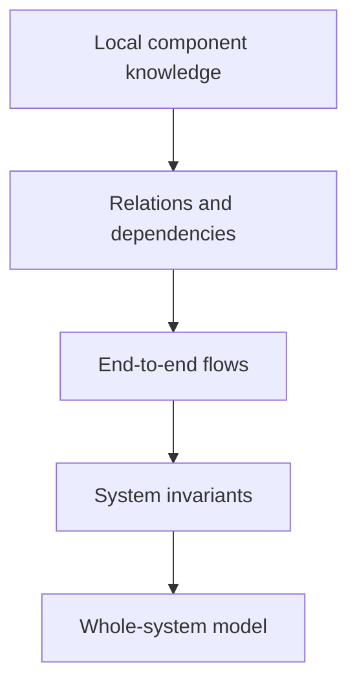
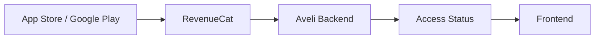

# 01 · Foundation

[Русская версия](README.ru.md)

This section explains **what SSAD is, which problem it solves, and why system knowledge should be structured around the real system rather than around a universal list of document types**.

Foundation is not a formal specification. It is the entry point into the way of thinking used by the rest of the methodology.

## SSAD in one statement

> **SSAD is a way to build and maintain system knowledge as a connected model of the real system rather than as a set of independent documents.**

In practice, this means first establishing system boundaries, responsibility areas and owners; then placing canonical knowledge with the appropriate owners and reconnecting local models into a coherent system view. The approach helps answer basic working questions: **what is known, where it came from, who has the relevant authority, where the canonical answer lives, how knowledge is connected, and what must be revisited when the system changes**.

---

## 1. The problem

System analysis is often documented through a familiar set of artifact categories:

```text
requirements/
diagrams/
api/
database/
security/
```

This is convenient while the question is simply: **“where is this kind of document stored?”**

But a real system is not organized by document type.

One feature can affect business rules, data, backend behavior, client state, API contracts, external integrations, security, failure handling and acceptance criteria at the same time.

As a result, knowledge about one system behavior becomes fragmented across artifact types. A reader must reconstruct the system from several disconnected places.

This is particularly expensive for onboarding. A new person sees documents before they understand the system, so they do not yet know what matters, where the source of truth is, how parts are related, or where one responsibility ends and another begins.

SSAD changes the primary object used to organize documentation.

> **Documents do not define the knowledge structure. The system does.**

---

## 2. The core idea

SSAD treats system-analysis documentation as an **engineering model of the system**.

First, understand the system itself:

```text
SYSTEM
  ↓
BOUNDARIES
  ↓
RESPONSIBILITIES
  ↓
OWNERSHIP
```

Then place knowledge inside those responsibility areas:

```text
OWNERSHIP
  ↓
LOCAL KNOWLEDGE
  ↓
CONNECTIONS
  ↓
SYSTEM VIEW
```

This does not mean every project should use the same folders.

A mobile product may naturally contain areas such as:

```text
business/
frontend/
backend/
database/
integrations/
system/
```

A desktop plugin or distributed platform may require a completely different shape.

> **The analytical questions and responsibility boundaries are required. Folder names are not.**

---

## 3. Why more files can mean less complexity

SSAD does not optimize for the smallest possible number of documents.

It optimizes for the **cost of finding, understanding and changing knowledge**.

A single `architecture.md` can look simple, but if it contains APIs, states, integrations, data, access rules and failure behavior, a local question requires reading a large amount of unrelated information.

A more decomposed structure can contain more files while giving each one a smaller responsibility.

> **Optimize the amount of knowledge a reader must inspect to answer a question, not the number of files in the repository.**

This is similar to well-structured source code: several small modules with explicit responsibilities are often easier to navigate than one universal module containing everything.

---

## 4. Responsibility boundaries

Every significant section and document should have an understandable responsibility.

A useful boundary lets the reader answer:

```text
What does this document describe?
What does it intentionally not describe?
Which knowledge is canonical here?
Which neighboring knowledge does it depend on?
```

A document such as `access-resolution.md` may own only the algorithm for calculating user access. It can link to API contracts, subscription state and trial rules without becoming the canonical description of all of them.

This leads to a central rule:

> **Do not duplicate knowledge. Duplicate only enough context to make local knowledge understandable.**

---

## 5. Canonical knowledge ownership

For meaningful system knowledge, SSAD encourages explicit ownership.

Useful questions include:

```text
Who makes the decision?
Who stores the authoritative state?
Who can change it?
Who consumes the result?
Who verifies correctness?
```

Ownership is not limited to data. A component can own a decision, a service can own a contract, a business area can own a rule, and the system level can own a cross-component invariant.

Without explicit ownership, multiple documents or components can easily create competing versions of the same knowledge.

---

## 6. Hierarchy stores, links connect

A file system is naturally hierarchical. That is useful for answering:

> Where is the canonical description stored?

A real system, however, is not a tree.

Authentication may be related to business rules, backend sessions, API contracts, frontend bootstrap, secure storage and access policy at the same time.

SSAD therefore uses two structures together:

```text
Hierarchy
→ placement and ownership

Knowledge graph
→ relationships between knowledge areas
```

> **Storage is hierarchical. Knowledge is connected as a graph.**

---

## 7. From local knowledge back to the whole system

Decomposition must not destroy the ability to understand the system as a whole.

When knowledge is distributed among owners, another layer must answer cross-component questions: end-to-end flows, data movement, trust sources, system invariants, failure behavior and multi-component changes.

SSAD calls this **system synthesis**.



Detailed documentation should let the reader drill down. The system layer should let them climb back up and see the whole.

---

## 8. Example: Aveli

The real project [Aveli System Analysis](https://github.com/branch-danya-dev/aveli-system-analysis) is used as one practical validation of the approach.

Instead of a repository shaped only by artifact categories, Aveli is organized around real system areas:

```text
business/
database/
backend/
frontend/
integrations/
system/
```

This is not an SSAD template. It is the result of analyzing Aveli specifically.

For example, backend knowledge is decomposed further into responsibilities such as access, authentication, billing and API behavior. The `system/` area does not compete with those owners: it owns cross-component flows, trust, invariants, dependencies and system-level synthesis.

### Ownership example

In Aveli, a successful subscription purchase is not equal to direct access.



The store confirms the purchase, RevenueCat provides billing evidence, the backend performs reconciliation and owns the final access decision, and the frontend consumes the calculated result.

Describing this only as a “RevenueCat integration” would hide the critical system question: **who actually owns the access decision?**

SSAD pushes responsibility before implementation detail.

---

## 9. Anti-example

Consider a repository with:

```text
requirements.md
api.md
database.md
diagrams.md
integrations.md
```

Each file may be correct in isolation. Yet a new reader may still need to reconstruct:

```text
Who makes the final access decision?
Which source wins when states conflict?
Does the frontend talk to the billing provider directly?
What happens offline?
```

SSAD treats this as a sign that local artifacts exist but **whole-system knowledge has not yet been synthesized**.

---

## 10. How SSAD explains knowledge

The methodology should teach, not merely define terms.

Important topics therefore follow a common learning pattern whenever useful:

```text
PROBLEM
   ↓
IDEA
   ↓
WHY
   ↓
QUESTIONS
   ↓
METHOD
   ↓
RESULT
   ↓
EXAMPLE
   ↓
DIAGRAM
   ↓
COMMON MISTAKES
   ↓
VERIFICATION
```

This is not a mandatory template for project documentation.

It is a **teaching standard for the methodology itself**: theory should show how to use the idea and what a good result looks like.

---

## 11. Core principles

| Principle | Meaning |
|---|---|
| **Documentation reflects the system** | Knowledge structure follows real boundaries and responsibilities. |
| **Responsibility before detail** | APIs, data and technology are stabilized after ownership is understood. |
| **One canonical owner** | Context may be repeated; independent competing definitions should not be. |
| **Local decomposition reduces reading cost** | More files are acceptable when each narrows the search space. |
| **Storage is hierarchical, knowledge is a graph** | Directories own placement; links express real relations. |
| **Decomposition requires synthesis** | The system must remain understandable as a whole. |
| **No universal repository template** | Different systems naturally produce different responsibility structures. |
| **Theory is grounded in practice** | Important ideas are explained through method, example and visual model. |
| **Knowledge evolves with the team and implementation** | Documentation is validated and changed during delivery, not merely handed off. |

---

## 12. What SSAD does not replace

SSAD does not replace UML, BPMN, C4, OpenAPI, ADRs, data schemas, user stories, backlogs, architecture standards or the team's development process.

Those tools answer their own questions.

SSAD answers another one:

> **How do we organize heterogeneous analytical knowledge into a coherent, navigable and maintainable model of a specific system?**

---

## 13. Understanding check

After Foundation, you should be able to explain:

1. Why SSAD does not prescribe a universal directory tree.
2. Why many small documents do not necessarily make a repository harder to use.
3. The difference between canonical knowledge and repeated context.
4. Why decomposition requires system synthesis.
5. Why an API contract alone does not describe system responsibility.
6. Why Aveli is an example of SSAD application rather than a template for other projects.

If those ideas are clear, move from the philosophy of the approach to the actual working process of a system analyst.

---

## Next

Continue with [`02 · Workflow`](../02-workflow/).

It answers a practical question:

> **A task has arrived. What does a system analyst actually do from preliminary analysis through delivery support and knowledge update?**
