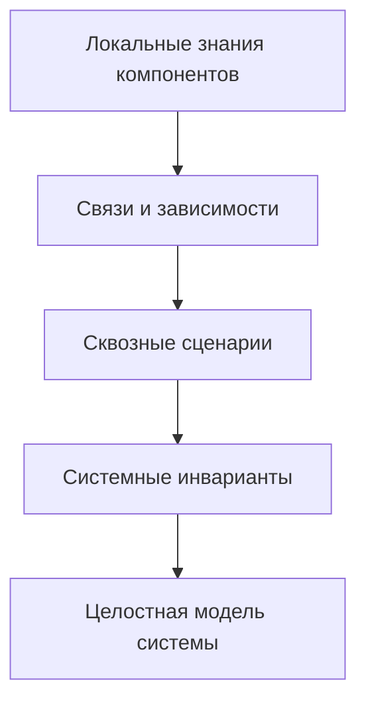

# 01 · Foundation

[English version](README.md)

Этот раздел объясняет **что такое SSAD, какую проблему решает подход и почему системное знание предлагается строить вокруг самой системы, а не вокруг универсального набора документов**.

Foundation — не формальная спецификация. Это точка входа в способ мышления, на котором построена вся методология.

## SSAD — коротко

> **SSAD — это способ формировать и поддерживать системное знание как связанную модель реальной системы, а не как набор независимых документов.**

В практической работе это означает: сначала установить границы системы, зоны ответственности и владельцев; затем разместить каноническое знание у соответствующих владельцев и связать локальные модели в целостное системное представление. Такой подход помогает ответить на базовые рабочие вопросы: **что мы знаем, откуда это известно, кто является authority, где находится канонический ответ, как знания связаны и что должно быть пересмотрено при изменении системы**.

---

## 1. Проблема

Системный анализ часто фиксируется через привычный набор артефактов:

```text
requirements/
diagrams/
api/
database/
security/
```

Такая структура удобна, пока нужно ответить на вопрос: **«где лежит конкретный тип документа?»**

Но реальная система устроена иначе.

Одна функция может одновременно затрагивать:

- бизнес-правила;
- данные;
- серверное поведение;
- клиентское состояние;
- API-контракты;
- внешние интеграции;
- безопасность;
- обработку отказов;
- критерии приёмки.

В результате знание о системе оказывается разрезано по типам артефактов. Чтобы понять один системный вопрос, читателю приходится собирать ответ из нескольких несвязанных мест.

Особенно тяжело это проявляется при погружении нового человека в проект. Он видит документы, но ещё не понимает систему, поэтому не знает:

```text
что важно;
где искать ответ;
какой документ является источником истины;
какие части связаны;
где заканчивается ответственность одного компонента и начинается другая.
```

SSAD предлагает изменить основной объект организации документации.

> **Не документы определяют структуру знания. Система определяет структуру знания.**

---

## 2. Основная идея

SSAD рассматривает системно-аналитическую документацию как **инженерную модель системы**.

Сначала определяется, как устроена анализируемая система:

```text
SYSTEM
  ↓
BOUNDARIES
  ↓
RESPONSIBILITIES
  ↓
OWNERSHIP
```

После этого знание размещается внутри найденных областей ответственности:

```text
OWNERSHIP
  ↓
LOCAL KNOWLEDGE
  ↓
CONNECTIONS
  ↓
SYSTEM VIEW
```

Это не означает, что каждый проект должен иметь одинаковые папки.

Мобильное приложение может естественно разделяться на:

```text
business/
frontend/
backend/
database/
integrations/
system/
```

Настольный плагин может иметь совсем другую модель:

```text
plugin/
host-application/
files/
integrations/
system/
```

А распределённая платформа — третью.

> **Обязательны системные вопросы и понятные зоны ответственности, а не названия директорий.**

---

## 3. Почему больше файлов может означать меньше сложности

SSAD не пытается минимизировать количество документов.

Она пытается минимизировать **стоимость поиска, понимания и изменения знания**.

Один большой файл может выглядеть проще:

```text
architecture.md
```

Но если внутри него находятся API, состояния, интеграции, данные, правила доступа и обработка ошибок, локальный вопрос требует чтения большого объёма нерелевантной информации.

Более детальная структура может содержать больше файлов:

```text
backend/
  access/
    access-resolution.md
  api/
    auth/
      contracts.md
  billing/
    reconciliation.md
```

Но у каждого файла появляется ограниченная ответственность.

Читателю не нужно знать весь проект, чтобы получить ответ на локальный вопрос.

Поэтому SSAD использует принцип:

> **Оптимизируй не количество документов, а область знания, которую человеку нужно прочитать для ответа на вопрос.**

Это похоже на хорошо структурированный исходный код: большое количество небольших модулей с понятной ответственностью часто проще сопровождать, чем один универсальный модуль, содержащий всё.

---

## 4. Границы ответственности

Каждый значимый раздел и документ должен иметь понятную ответственность.

Хорошая граница позволяет ответить:

```text
Что описывает этот документ?
Что он намеренно не описывает?
Какое знание здесь является каноническим?
На какие соседние знания он опирается?
```

Например, документ `access-resolution.md` может отвечать только за алгоритм вычисления доступа пользователя.

Он может ссылаться на API-контракт, состояние подписки и правила пробного периода, но не должен повторно становиться каноническим описанием каждого из них.

Так возникает следующий принцип.

> **Не дублируй знание. При необходимости дублируй только контекст.**

Небольшое повторение контекста допустимо, если оно делает локальный документ понятным. Но источник правила, состояния или контракта должен оставаться один.

---

## 5. Каноническое владение знанием

Для значимого системного знания SSAD предлагает явно понимать владельца.

Полезные вопросы:

```text
Кто принимает решение?
Кто хранит достоверное состояние?
Кто может его изменить?
Кто использует результат?
Кто подтверждает корректность?
```

Владение относится не только к данным.

Владельцем может быть:

- компонент, принимающий решение;
- сервис, публикующий контракт;
- хранилище, содержащее каноническое состояние;
- бизнес-область, определяющая правило;
- системный уровень, владеющий межкомпонентным инвариантом.

Когда владелец не определён, несколько документов или компонентов легко создают разные версии одного и того же знания.

---

## 6. Иерархия хранит, ссылки связывают

Файловая система по природе иерархична.

Это удобно для ответа на вопрос:

> Где находится каноническое описание?

Но реальная система не является деревом.

Аутентификация может одновременно быть связана с:

```text
business rule
    ↕
backend session
    ↕
API contract
    ↕
frontend bootstrap
    ↕
secure storage
    ↕
access policy
```

Поэтому SSAD использует две структуры одновременно:

```text
Иерархия
→ размещение и владение

Граф ссылок
→ отношения между знаниями
```

> **Хранение иерархично. Знание связано графом.**

---

## 7. От локальных знаний к системе целиком

Декомпозиция не должна разрушать целостное понимание системы.

Если знание разделено по владельцам, нужен слой, который отвечает на межкомпонентные вопросы:

- как проходит сквозной сценарий;
- как движутся данные;
- где находятся доверенные источники;
- какие системные инварианты должны сохраняться;
- как ведёт себя система при отказах;
- что происходит при изменении нескольких компонентов сразу.

SSAD называет это **системным синтезом**.



Детальная документация должна позволять углубляться. Системный слой должен позволять снова подняться наверх и увидеть целое.

---

## 8. Пример: Aveli

Реальный проект [Aveli System Analysis](https://github.com/branch-danya-dev/aveli-system-analysis) используется как одно из практических подтверждений подхода.

Вместо единой структуры по типам артефактов репозиторий организован вокруг реальных областей системы:

```text
business/
database/
backend/
frontend/
integrations/
system/
```

Это не шаблон SSAD. Это результат анализа именно Aveli.

Например:

```text
backend/
  access/
  auth/
  billing/
  api/
```

делит серверное знание уже по локальным ответственностям.

А `system/` не конкурирует с ними. Он отвечает за то, что нельзя корректно приписать одному компоненту: сквозные потоки, инварианты, доверие, межкомпонентные зависимости и целостное представление системы.

### Конкретный пример владения

В Aveli покупка подписки не означает прямое предоставление доступа.


Здесь:

- магазин подтверждает покупку;
- RevenueCat является внешним источником биллинговой информации;
- backend выполняет сверку и принимает итоговое решение о доступе;
- frontend потребляет уже рассчитанное состояние.

Если всё это описать только как «интеграцию с RevenueCat», теряется главное системное знание: **кто именно принимает решение о доступе**.

SSAD заставляет сначала увидеть ответственность, а потом уже фиксировать API, данные и технологии.

---

## 9. Антипример

Представим документацию:

```text
requirements.md
api.md
database.md
diagrams.md
integrations.md
```

В `requirements.md` написано:

> Активная подписка предоставляет доступ.

В `integrations.md`:

> RevenueCat сообщает состояние entitlement.

В `api.md`:

> `/access/status` возвращает доступ пользователя.

В `database.md`:

> Backend хранит manual access и trial expiration.

Каждый документ отдельно может быть правильным.

Но новичку всё ещё приходится самостоятельно восстановить системную модель:

```text
Кто принимает финальное решение?
Какой источник авторитетнее?
Что происходит при конфликте trial и subscription?
Работает ли frontend напрямую с RevenueCat?
Что происходит офлайн?
```

SSAD считает такую ситуацию признаком того, что **локальные артефакты существуют, а целостное системное знание ещё не собрано**.

---

## 10. Как объясняется знание в SSAD

Эта методология должна быть пригодна не только для опытного аналитика, но и для человека, который изучает подход.

Поэтому существенная тема по возможности раскрывается через одну и ту же учебную конструкцию:

```text
ПРОБЛЕМА
   ↓
ИДЕЯ
   ↓
ПОЧЕМУ
   ↓
ВОПРОСЫ
   ↓
МЕТОД
   ↓
РЕЗУЛЬТАТ
   ↓
ПРИМЕР
   ↓
СХЕМА
   ↓
ТИПИЧНЫЕ ОШИБКИ
   ↓
ПРОВЕРКА
```

Это не обязательный шаблон для проектной документации.

Это **стандарт объяснения самой методологии**: теория должна показывать, как применять идею и как выглядит результат.

---

## 11. Базовые принципы

На фундаментальном уровне SSAD опирается на следующие правила.

| Принцип | Смысл |
|---|---|
| **Документация отражает систему** | Структура знания следует реальным границам и ответственностям. |
| **Сначала ответственность, затем детали** | API, данные и технологии описываются после понимания владельца поведения. |
| **Один канонический владелец знания** | Контекст можно повторять, независимые версии одного правила — нет. |
| **Локальная декомпозиция уменьшает стоимость чтения** | Больше файлов допустимо, если каждый уменьшает область поиска. |
| **Хранение иерархично, знание связано графом** | Директории определяют размещение, ссылки — реальные отношения. |
| **Декомпозиция требует синтеза** | Система должна оставаться понятной как целое. |
| **Структура не является универсальным шаблоном** | Разные системы имеют разные естественные области ответственности. |
| **Теория подтверждается практикой** | Существенные идеи объясняются методом, примером и визуальной моделью. |
| **Документация живёт вместе с командой и реализацией** | Знание проверяется и изменяется по мере разработки, а не просто передаётся команде. |

---

## 12. Что SSAD не пытается заменить

SSAD не заменяет:

- UML;
- BPMN;
- C4;
- OpenAPI;
- ADR;
- схемы данных;
- user stories;
- backlog;
- архитектурные стандарты;
- процесс разработки команды.

Эти инструменты отвечают на свои вопросы.

SSAD отвечает на другой:

> **Как собрать разнородные аналитические знания в целостную, навигируемую и поддерживаемую модель конкретной системы?**

---

## 13. Проверка понимания

После Foundation должно быть возможно объяснить своими словами:

1. Почему SSAD не задаёт универсальное дерево директорий?
2. Почему большое количество небольших документов не обязательно усложняет проект?
3. Чем каноническое знание отличается от контекстного повторения?
4. Зачем после декомпозиции нужен системный синтез?
5. Почему API-контракт сам по себе ещё не описывает системную ответственность?
6. Почему структура Aveli является примером применения SSAD, но не шаблоном для других проектов?

Если ответы на эти вопросы понятны, можно переходить от философии подхода к реальному рабочему процессу системного аналитика.

---

## Дальше

Следующий раздел: [`02 · Workflow`](../02-workflow/)

Он отвечает уже не на вопрос **«как организовать системное знание?»**, а на практический вопрос:

> **Мне пришла задача. Что я делаю как системный аналитик от предварительного анализа до поддержки реализации и обновления знаний?**
