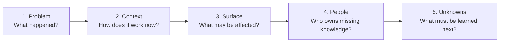
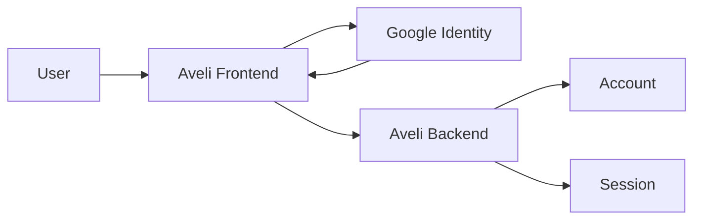

# 00 · Pre-analysis

[Русская версия](README.ru.md)

Pre-analysis is the first pass over a task before detailed requirements work and solution design.

Its purpose is not to immediately invent an architecture. Its purpose is to understand **what happened, why the work is needed, what parts of the system may be affected, and what is still unknown**.

---

## Problem

Tasks rarely arrive in a system-ready form.

A request may look like:

```text
"Add Google login"
"Add Excel export"
"Fix tariff calculation"
"Add a new order status"
```

Such wording usually lacks system context.

For example, "Add Google login" does not yet tell us:

- whether Google replaces or supplements the current login method;
- how Google identity maps to an existing account;
- who remains the owner of user identity;
- what happens when emails match;
- how active sessions change;
- whether Google can be disconnected;
- what happens if Google is unavailable;
- which frontend, backend and integration components are affected.

If specification starts immediately, the analyst risks designing a solution before understanding the task itself.

---

## Main question

> **What do we already know about the task, what may be affected, and what is still missing before detailed analysis can start?**

---

## Inputs

The input may be minimal:

- a tracker ticket;
- a Product Owner message;
- a client request;
- a defect;
- a feature idea;
- an integration change;
- a technical initiative;
- a regulatory requirement;
- an operational problem.

SSAD does not require a complete input package. Pre-analysis starts with the evidence that actually exists.

---

## People

Participants depend on the task. The purpose is to identify **who holds the missing knowledge**.

| Participant | Typical knowledge source |
|---|---|
| Product / requester | reason for change, expected outcome, priority |
| Business Analyst | business rules, user scenarios, constraints |
| System Analyst | dependencies, contracts, historical decisions |
| Developer | actual current behavior, implementation constraints |
| Architect | architectural boundaries and allowed dependencies |
| QA | edge cases, known defects, verifiability |
| Integration owner | external contract, constraints, SLA, behavior |
| Support / Operations | real production problems and recurring failures |

Pre-analysis does not mean meeting everyone. It should reveal **who actually needs to be involved next**.

---

## Questions

### Problem

```text
What happened?
Why is current behavior insufficient?
Who experiences the problem?
What happens if nothing changes?
```

### Expected outcome

```text
What should become possible after the change?
How will a user or system know the problem is solved?
What must not change?
```

### Current system

```text
How does it work today?
Which component makes the decision?
Where is state stored?
Which interfaces participate?
Are there external dependencies?
```

### Boundaries

```text
Which parts of the system may be affected?
Are neighboring services or teams involved?
Does an external contract change?
Does ownership of data or behavior change?
```

### Unknowns

```text
Which assumptions are we making?
What must be verified?
Which questions block further design?
```

---

## SSAD method

Pre-analysis can be performed as a short five-step pass.



### 1. Problem

State the problem separately from the proposed solution.

Weak:

```text
We need to add Google Login.
```

Better:

```text
The user needs an authentication option that does not require
maintaining a separate Aveli password.
```

The first statement already contains a solution. The second states the need.

### 2. Context

Recover the minimum current-state knowledge needed:

```text
participants;
responsible component;
state owner;
current scenario.
```

### 3. Surface

Do not perform full impact analysis yet. Identify the initial area of possible impact.

For example:

```text
Frontend auth
Backend auth
Account model
Session model
External identity provider
Recovery / logout behavior
QA scenarios
```

This is an **initial change surface**, not the final design.

### 4. People

Map each unknown to a likely knowledge source.

```text
Question: Can Google identity be linked to an existing account?
Source: Product + backend owner.

Question: Which fields does Google guarantee?
Source: integration documentation / integration owner.
```

### 5. Unknowns

Separate evidence from assumptions.

A simple confidence model can be used:

```text
VERIFIED — confirmed
INFERRED — inferred from available evidence
OPEN — requires an answer
```

---

## Output

Pre-analysis does not need to produce a large document.

A sufficient result may contain:

```text
Problem
Context
Expected outcome
Initial scope
Potentially affected areas
Stakeholders / knowledge sources
Known constraints
Open questions
Initial change surface
```

The important result is that the analyst knows **what to investigate next**.

---

## Example

### Initial request

```text
Add Google login to Aveli.
```

### After pre-analysis

**Problem**

Users should be able to authenticate without maintaining a separate Aveli password.

**Current context**

```text
User
 ↓
Aveli Frontend
 ↓
Aveli Backend
 ↓
Account + Session
```

The backend remains the trusted owner of the account and server session.

**Initial change surface**

```text
frontend/auth
backend/auth
account identity model
session lifecycle
external identity integration
logout / account deletion
QA authentication scenarios
```

**Open questions**

```text
OPEN — Does Google login create a new account or link an existing one?
OPEN — What happens when email already exists?
OPEN — Can Google identity be disconnected?
OPEN — Which provider identifier is stored by backend?
OPEN — Does this affect password recovery?
```

### Diagram



At this stage the diagram does not need to be the final architecture. It visualizes the expected investigation boundary.

---

## Common mistakes

### Designing immediately

```text
Request → API → DB schema
```

without understanding the problem and boundaries.

### Treating stakeholder wording as a system requirement

```text
"Add a button"
```

may be only the interface expression of a deeper system change.

### Treating assumptions as facts

An assumption such as "Google always returns email" must not silently become part of the design.

### Analyzing the whole system

Pre-analysis should narrow the next work, not become a complete product audit.

### Not identifying knowledge owners

A list of questions without knowing who can answer them does not move the task forward effectively.

---

## Return / stop conditions

Detailed Requirements or Analysis should not start when a critical condition remains unclear:

- the problem itself is unknown;
- the requester or decision owner cannot be identified;
- current behavior is not understood at all;
- the requested change conflicts with known system boundaries;
- a critical integration or knowledge owner is inaccessible;
- several fundamentally different interpretations are equally plausible.

This does not mean every question must be resolved. A list of `OPEN` questions is a valid pre-analysis result.

The important point is that the next work has a clear direction.

---

## Completion check

Before moving to Requirements, the analyst should be able to answer:

- [ ] what problem the task solves;
- [ ] how the related scenario works today;
- [ ] what outcome is expected;
- [ ] which system areas may be affected;
- [ ] who owns the required knowledge;
- [ ] which constraints are already known;
- [ ] which questions remain open;
- [ ] what exactly must be investigated next.

If these answers exist, Pre-analysis has done its job.

---

## Connection to the rest of SSAD

Pre-analysis does not yet create a complete system model.

It creates the route for the next work:

```text
PRE-ANALYSIS
   ↓
REQUIREMENTS
   ↓
ANALYSIS METHODS
   ↓
KNOWLEDGE STRUCTURE
   ↓
TEAM VALIDATION
```

Next stage: **Requirements**.
