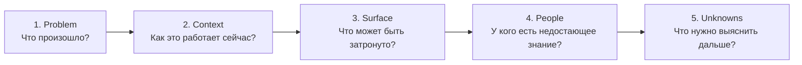
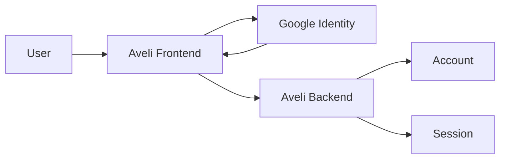

# 00 · Pre-analysis

[English version](README.md)

Предварительный анализ — это первый проход по задаче до детального сбора требований и проектирования решения.

Его цель не в том, чтобы сразу придумать архитектуру. Его цель — понять, **что произошло, зачем вообще нужна работа, какие части системы потенциально затронуты и чего мы пока не знаем**.

---

## Проблема

Задачи редко приходят аналитику в готовой системной форме.

Типичный запрос может звучать так:

```text
«Добавить вход через Google»
«Сделать экспорт в Excel»
«Исправить расчёт тарифа»
«Добавить новый статус заказа»
```

В такой формулировке почти всегда отсутствует системный контекст.

Например, запрос «Добавить вход через Google» ещё не говорит:

- Google заменяет или дополняет существующий способ входа;
- как связывать Google identity с существующим аккаунтом;
- кто остаётся владельцем пользовательской identity;
- что делать при совпадении email;
- как изменятся активные сессии;
- можно ли отвязать Google;
- что происходит при недоступности Google;
- какие backend/frontend/integration-компоненты затронуты.

Если сразу перейти к спецификации, аналитик рискует проектировать решение до того, как понял саму задачу.

---

## Главный вопрос этапа

> **Что мы уже знаем о задаче, что потенциально затронуто и чего недостаточно для начала детального анализа?**

---

## Входы

На входе может быть очень мало информации:

- задача в трекере;
- сообщение от Product Owner;
- запрос клиента;
- дефект;
- идея новой функции;
- изменение внешней интеграции;
- техническая инициатива;
- регуляторное требование;
- проблема эксплуатации.

SSAD не требует полного набора входных артефактов. Pre-analysis начинается с того, что реально доступно.

---

## С кем взаимодействовать

Набор участников зависит от задачи, но на предварительном анализе полезно быстро определить, **кто обладает недостающим знанием**.

| Участник | Что обычно можно выяснить |
|---|---|
| Product / заказчик | зачем нужно изменение, ожидаемый результат, приоритет |
| Business Analyst | бизнес-правила, пользовательские сценарии, ограничения |
| System Analyst | существующие зависимости, контракты, исторические решения |
| Developer | реальное текущее поведение, технические ограничения |
| Architect | архитектурные границы и допустимые зависимости |
| QA | проблемные сценарии, известные дефекты, проверяемость |
| Integration owner | внешний контракт, ограничения, SLA, особенности поведения |
| Support / Operations | реальные проблемы эксплуатации и типовые сбои |

Pre-analysis не означает провести встречу со всеми. Он должен показать, **кого действительно нужно подключить дальше**.

---

## Какие вопросы задать

### О проблеме

```text
Что произошло?
Почему текущего поведения недостаточно?
Кто испытывает проблему?
Что изменится, если ничего не делать?
```

### О желаемом результате

```text
Что должно стать возможным после изменения?
Как пользователь или система поймёт, что задача решена?
Что точно не должно измениться?
```

### О текущей системе

```text
Как это работает сейчас?
Какой компонент принимает решение?
Где хранится состояние?
Какие интерфейсы участвуют?
Есть ли внешние зависимости?
```

### О границах

```text
Какие части системы потенциально затронуты?
Есть ли соседние сервисы или команды?
Меняется ли внешний контракт?
Меняется ли ownership данных или поведения?
```

### О неизвестных

```text
Какие предположения мы сейчас делаем?
Что требуется подтвердить?
Какие вопросы блокируют дальнейшее проектирование?
```

---

## Метод SSAD

Pre-analysis можно выполнить как короткий проход по пяти шагам.



### 1. Problem

Сформулировать проблему отдельно от предполагаемого решения.

Плохо:

```text
Нужно добавить Google Login.
```

Лучше:

```text
Пользователю требуется альтернативный способ аутентификации,
который не требует отдельного пароля Aveli.
```

Первая формулировка уже содержит решение. Вторая описывает потребность.

### 2. Context

Восстановить минимально необходимое текущее состояние:

```text
кто участвует;
какой компонент отвечает;
где хранится состояние;
какой сценарий существует сейчас.
```

### 3. Surface

Не проводить полный impact analysis, а определить первичный круг возможного влияния.

Например:

```text
Frontend auth
Backend auth
Account model
Session model
External identity provider
Recovery / logout behavior
QA scenarios
```

Это **initial change surface**, а не окончательное решение.

### 4. People

Для каждого неизвестного определить источник знания.

```text
Вопрос: можно ли связать Google identity с существующим аккаунтом?
Источник: Product + backend owner.

Вопрос: какие данные гарантированно возвращает Google?
Источник: integration documentation / integration owner.
```

### 5. Unknowns

Явно отделить факты от предположений.

Можно использовать простую маркировку:

```text
VERIFIED — подтверждено
INFERRED — предполагается на основании доступных данных
OPEN — требует ответа
```

---

## Результат этапа

Pre-analysis не обязан создавать большой документ.

Достаточный результат может выглядеть так:

```text
Problem
Context
Expected outcome
Initial scope
Potentially affected areas
Stakeholders / knowledge sources
Known constraints
Open questions
Initial change surface
```

Главное — после этапа должно быть понятно, **что именно исследовать дальше**.

---

## Пример

### Исходный запрос

```text
Добавить вход через Google в Aveli.
```

### После предварительного анализа

**Problem**

Пользователь должен иметь возможность аутентифицироваться без отдельного пароля Aveli.

**Current context**

```text
User
 ↓
Aveli Frontend
 ↓
Aveli Backend
 ↓
Account + Session
```

Backend остаётся доверенным владельцем аккаунта и серверной сессии.

**Initial change surface**

```text
frontend/auth
backend/auth
account identity model
session lifecycle
external identity integration
logout / account deletion
QA authentication scenarios
```

**Open questions**

```text
OPEN — Google login создаёт новый аккаунт или связывается с существующим?
OPEN — что происходит при совпадении email?
OPEN — можно ли отвязать Google?
OPEN — какой provider identifier хранится на backend?
OPEN — влияет ли новый способ входа на password recovery?
```

### Схема



На этом этапе схема не обязана быть окончательной архитектурой. Она помогает показать предполагаемые границы исследования.

---

## Типичные ошибки

### Сразу проектировать решение

```text
Запрос → API → DB schema
```

без понимания проблемы и границ.

### Принимать формулировку заказчика за системное требование

```text
«Добавить кнопку»
```

может быть только интерфейсной формой гораздо более глубокого изменения.

### Считать неизвестное фактом

Предположение вроде «Google всегда возвращает email» не должно незаметно становиться частью решения.

### Анализировать всю систему

Pre-analysis должен сузить дальнейшую работу, а не превращаться в полный аудит продукта.

### Не определять владельцев недостающего знания

Список вопросов без понимания, кто способен на них ответить, плохо помогает движению задачи.

---

## Когда нельзя переходить дальше

Детальный Requirements/Analysis не стоит начинать, если остаётся непонятным хотя бы одно из критических условий:

- неизвестно, какую проблему решаем;
- невозможно определить владельца запроса;
- отсутствует понимание текущего поведения;
- предполагаемое изменение противоречит известным границам системы;
- отсутствует доступ к критическому владельцу интеграции или знания;
- несколько принципиально разных трактовок задачи одинаково вероятны.

Это не означает, что все вопросы должны быть закрыты. Наоборот, список `OPEN` — нормальный результат Pre-analysis.

Важно, чтобы дальнейшая работа имела понятное направление.

---

## Completion check

Перед переходом к Requirements аналитик должен суметь кратко ответить:

- [ ] какую проблему решает задача;
- [ ] как связанный сценарий работает сейчас;
- [ ] какой результат ожидается;
- [ ] какие области системы потенциально затронуты;
- [ ] кто владеет необходимым знанием;
- [ ] какие ограничения уже известны;
- [ ] какие вопросы остаются открытыми;
- [ ] что именно нужно исследовать на следующем этапе.

Если эти ответы существуют, Pre-analysis выполнил свою функцию.

---

## Связь с остальной SSAD

Pre-analysis ещё не создаёт полную системную модель.

Он формирует маршрут дальнейшей работы:

```text
PRE-ANALYSIS
   ↓
REQUIREMENTS
   ↓
ANALYSIS METHODS
   ↓
KNOWLEDGE STRUCTURE
   ↓
TEAM VALIDATION
```

Следующий этап: **Requirements**.
