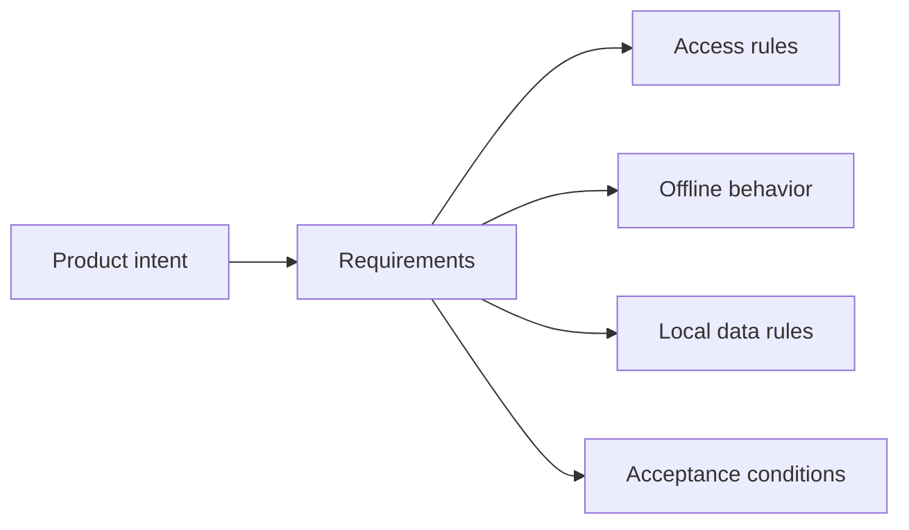

# 01 · Requirements

[Русская версия](README.ru.md)

This stage answers:

> **How do we turn an initial request, conversations and fragmented context into a verifiable set of requirements, constraints, facts and open questions?**

Requirements in SSAD are not merely a list of “the system shall” statements. They are the result of clarifying **what behavior is actually required, for whom, under which conditions, and within which boundaries**.

## Inputs

Typical inputs from pre-analysis:

- original request;
- problem statement;
- stakeholders;
- preliminary scope;
- known constraints;
- initial change surface;
- open questions.

## What the analyst does

The analyst:

1. clarifies expected behavior;
2. separates wishes from mandatory requirements;
3. discovers constraints and dependencies;
4. explores edge and negative scenarios;
5. records unknowns;
6. checks consistency;
7. connects requirements to real system participants.

## Participants

Product, business analysis, system owners, integration owners, developers, QA, architects, security and operations may all contribute evidence and constraints.

SSAD treats requirements as **team-validated knowledge**, not as private analyst notes.

## Core questions

Ask about:

- goal and value;
- expected behavior;
- scope and boundaries;
- data and source of truth;
- states and transitions;
- integration behavior and failures;
- acceptance and verification.

## Working method

### 1. Start with expected outcome

Do not start from UI or technology.

Weak:

> Add a Google Login button.

Better:

> A user must be able to authenticate through Google and access an existing or new account according to identity-linking rules.

### 2. Separate knowledge classes

```text
Business / Product intent
        ↓
Behavioral requirements
        ↓
System constraints
        ↓
Acceptance conditions
```

These are knowledge classes, not mandatory folders.

### 3. Mark confidence

```text
VERIFIED — directly confirmed
INFERRED — logically derived but not directly confirmed
OPEN     — requires a decision or confirmation
```

### 4. Check consistency

Validate requirements against other requirements, current behavior, contracts, ownership, constraints and negative scenarios.

### 5. Prepare input for system design

Requirements should be clear enough to analyze:

```text
BOUNDARIES
RESPONSIBILITIES
OWNERSHIP
DATA
STATES
INTERFACES
FLOWS
SYSTEM DESIGN
```

## Expected output

A useful result usually contains:

```text
Problem / Goal
Scope
Stakeholders
Behavioral requirements
Business rules
System constraints
Data implications
Integration constraints
Edge cases
Acceptance conditions
Open questions
Evidence / confidence
```

## Aveli example: offline access

A vague requirement:

> The user should be able to work without internet access.

System analysis expands it into questions about available capabilities, prior account verification, subscription expiration, cached trust, local data, logout behavior and revalidation.

A more useful set of requirements becomes:

```text
1. Professional data remains locally available.
2. Access authority belongs to the backend.
3. Previously verified access may temporarily be reused offline.
4. Offline trust is limited by a revalidation deadline.
5. Access expiration does not delete local professional data.
```



## Common mistakes

- collecting only the happy path;
- mixing requirements with implementation choices;
- taking stakeholder wording literally without clarification;
- hiding unknowns instead of marking them OPEN;
- treating requirements as finished before team validation.

## Completion check

The stage is ready to move forward when the goal, scope, major behavior, constraints, affected data and integrations, edge cases, acceptance conditions and critical open questions are explicit enough to begin system design.

Next: [`02-analysis-and-design/`](../02-analysis-and-design/)
