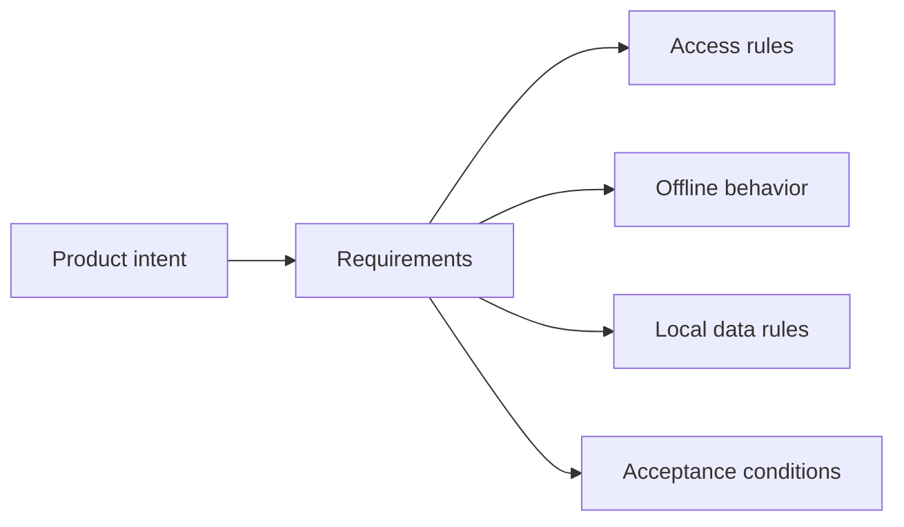

# 01 · Requirements

[English version](README.md)

Этот этап отвечает на вопрос:

> **Как превратить исходный запрос, разговоры и разрозненный контекст в проверяемый набор требований, ограничений, фактов и открытых вопросов?**

Требования в SSAD — это не просто список формулировок вида «система должна». Это результат уточнения того, **какое поведение действительно требуется, для кого, при каких условиях и в каких границах**.

---

## 1. Вход этапа

Обычно на входе уже есть результаты предварительного анализа:

- исходный запрос;
- понимание проблемы;
- заинтересованные стороны;
- предварительный scope;
- известные ограничения;
- первичная область влияния;
- список открытых вопросов.

Если этих данных нет или они противоречат друг другу, этап требований должен сначала восстановить недостающий контекст.

---

## 2. Что делает системный аналитик

На этом этапе аналитик:

1. уточняет ожидаемое поведение;
2. отделяет пожелания от обязательных требований;
3. выявляет ограничения и зависимости;
4. ищет исключения и граничные сценарии;
5. фиксирует неизвестные;
6. проверяет требования на непротиворечивость;
7. связывает требования с реальными участниками системы.

---

## 3. С кем взаимодействовать

В зависимости от задачи могут участвовать:

| Участник | Что от него нужно |
|---|---|
| Product / заказчик | цель, ценность, ожидаемое поведение, приоритеты |
| Business Analyst | бизнес-правила, процессы, ограничения предметной области |
| System owner | текущее поведение системы и системные ограничения |
| Integration owner | контракт, SLA, ограничения внешней системы |
| Developer | реализуемость, текущая реализация, технические факты |
| QA | проверяемость, edge cases, негативные сценарии |
| Architect / Security / Ops | архитектурные, доверительные, эксплуатационные ограничения |

SSAD исходит из того, что требования формируются **не в одиночку аналитиком**, а через проверяемый обмен знаниями.

---

## 4. Какие вопросы задавать

### О цели

- Какую проблему решаем?
- Какой результат нужен пользователю или бизнесу?
- Что произойдёт, если ничего не менять?

### О поведении

- Что должна делать система?
- При каких условиях?
- Что должно происходить в негативном сценарии?
- Какие действия недопустимы?

### О границах

- Что входит в задачу?
- Что явно не входит?
- Какие компоненты или внешние системы участвуют?

### О данных

- Какие данные создаются, читаются, изменяются или удаляются?
- Кто считается источником истины?
- Есть ли чувствительные или регуляторно значимые данные?

### О состояниях

- Какие состояния существуют до и после изменения?
- Какие переходы допустимы?
- Есть ли промежуточные или ошибочные состояния?

### Об интеграциях

- Какой контракт существует сейчас?
- Кто им владеет?
- Что произойдёт при недоступности интеграции?
- Есть ли retry, timeout, idempotency или порядок событий?

### О проверке

- Как команда поймёт, что требование реализовано правильно?
- Можно ли его проверить однозначно?

---

## 5. Рабочий метод

### Шаг 1. Сформулировать ожидаемый результат

Не начинай с интерфейса или технологии.

Плохо:

> Добавить кнопку Google Login.

Лучше:

> Пользователь должен иметь возможность аутентифицироваться через Google и получить доступ к существующему или новому аккаунту согласно правилам связывания идентичностей.

---

### Шаг 2. Разделить требования по смыслу

Минимально полезно различать:

```text
Business / Product intent
        ↓
Behavioral requirements
        ↓
System constraints
        ↓
Acceptance / verification conditions
```

Это не обязательные директории и не обязательный шаблон документа. Это разные классы знания.

---

### Шаг 3. Пометить достоверность

Используй простую модель:

```text
VERIFIED — подтверждено источником или реализацией
INFERRED — логически выведено, но не подтверждено напрямую
OPEN     — требует решения или подтверждения
```

Не превращай предположение в требование только потому, что оно выглядит логично.

---

### Шаг 4. Проверить внутреннюю согласованность

Каждое значимое требование должно быть проверено против:

- других требований;
- известных ограничений;
- текущего поведения;
- существующих контрактов;
- правил данных и ownership;
- негативных сценариев.

---

### Шаг 5. Подготовить требования к системному анализу

На выходе требования должны быть достаточно ясными, чтобы можно было переходить к:

```text
BOUNDARIES
RESPONSIBILITIES
OWNERSHIP
DATA
STATES
INTERFACES
FLOWS
SYSTEM DESIGN
```

То есть Requirements не заканчиваются списком текста — они становятся входом для системного проектирования.

---

## 6. Результат этапа

Хороший результат Requirements обычно содержит:

```text
Problem / Goal
Scope
Stakeholders
Behavioral requirements
Business rules
System constraints
Data implications
Integration constraints
Edge cases
Acceptance conditions
Open questions
Evidence / confidence
```

Физически это может быть один файл или несколько документов — SSAD не навязывает форму хранения до определения реальной ответственности знания.

---

## 7. Пример: Aveli — офлайн-доступ

Исходная формулировка могла бы звучать так:

> Пользователь должен иметь возможность работать без интернета.

Этого недостаточно.

Системный анализ требований раскрывает вопросы:

- какие функции доступны офлайн;
- нужен ли ранее подтверждённый аккаунт;
- что происходит после окончания подписки;
- сколько можно доверять кэшированному состоянию доступа;
- какие данные остаются локальными;
- что происходит после logout;
- когда требуется повторная серверная проверка.

Требование превращается в набор более точных утверждений:

```text
1. Профессиональные данные должны оставаться доступными локально.
2. Право доступа определяется сервером.
3. Ранее подтверждённый доступ может временно использоваться офлайн.
4. Офлайн-доверие ограничено сроком повторной проверки.
5. Истечение доступа не удаляет локальные профессиональные данные.
```

Связь знаний:



---

## 8. Типичные ошибки

### Собирать только happy path

Требование считается неполным, если неизвестно поведение при ошибке, недоступности зависимости или конфликте состояний.

### Смешивать требование и реализацию

> «Использовать Redis для хранения сессий»

не является продуктовым требованием, если технология не является внешним ограничением.

### Принимать слова заказчика буквально

Фраза «всегда доступно» должна быть раскрыта через конкретные условия.

### Не фиксировать неизвестные

`OPEN` лучше ложной определённости.

### Считать требования завершёнными до проверки командой

Разработчики, QA и владельцы интеграций могут обнаружить ограничения, которых не было в исходном разговоре.

---

## 9. Когда этап можно завершить

Проверь:

- [ ] понятна цель изменения;
- [ ] scope определён;
- [ ] ключевые заинтересованные стороны известны;
- [ ] основное поведение сформулировано;
- [ ] негативные и граничные сценарии рассмотрены;
- [ ] ограничения зафиксированы;
- [ ] данные и интеграции, которые могут быть затронуты, выявлены;
- [ ] открытые вопросы явно отмечены;
- [ ] требования можно проверить;
- [ ] информации достаточно, чтобы начать системный анализ и проектирование.

Если хотя бы один критичный вопрос остаётся неизвестным, работа может перейти в Analysis только с явным `OPEN`, а не с молчаливым предположением.

---

## 10. Куда дальше

Следующий этап: [`02-analysis-and-design/`](../02-analysis-and-design/)

Подробные методы декомпозиции системы находятся в [`../../03-analysis/`](../../03-analysis/).
