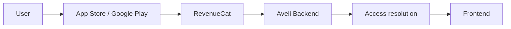

# 02 · Analysis & Design

[English version](README.md)

Этот этап отвечает на вопрос:

> **Как превратить требования и ограничения в согласованную модель системы и проектное решение?**

На этом этапе SSAD перестаёт быть только процессом работы и становится методом системного мышления.

Требования говорят, **что должно быть обеспечено**. Analysis & Design определяет, **какие части системы за это отвечают, как они взаимодействуют и какие знания должны быть согласованы до реализации**.

---

## 1. Вход этапа

Обычно на входе уже есть:

- проблема и цель;
- scope;
- требования;
- ограничения;
- известные участники системы;
- affected components / integrations;
- open questions;
- evidence / confidence status.

Если требования противоречивы или критичные ограничения неизвестны, Analysis & Design может вернуть работу в Requirements.

---

## 2. Главная логика SSAD

Системное решение строится не от технологий и не от готового списка артефактов.

Оно строится через последовательность:

```text
BOUNDARIES
    ↓
RESPONSIBILITIES
    ↓
OWNERSHIP
    ↓
BEHAVIOR / STATES / DATA
    ↓
INTERFACES
    ↓
FLOWS
    ↓
SYSTEM SYNTHESIS
```

Это не жёсткий waterfall. Любая поздняя находка может переоткрыть раннее решение.

---

## 3. Определи границы

Сначала нужно понять:

- что относится к анализируемой системе;
- что находится за её пределами;
- какие внешние акторы и системы участвуют;
- какие части задачи являются внутренними изменениями, а какие — внешними зависимостями.

Пока границы размыты, любое дальнейшее решение нестабильно.

---

## 4. Раздели ответственность

Для каждой значимой области спроси:

- за какое поведение она отвечает;
- какие решения принимает;
- какие данные хранит;
- какие интерфейсы предоставляет;
- от чего зависит;
- что явно не входит в её ответственность.

SSAD не требует заранее известных названий компонентов. В одном проекте это могут быть `frontend`, `backend`, `database`, в другом — `plugin`, `host`, `worker`, `gateway`, `operations`.

---

## 5. Определи ownership

Для каждого значимого знания или состояния должно быть понятно:

```text
Кто принимает решение?
Кто хранит каноническое состояние?
Кто может его изменить?
Кто его использует?
Кто подтверждает корректность?
```

Ownership должен быть определён до стабилизации контрактов и зависимого поведения.

---

## 6. Смоделируй поведение, состояния и данные

После определения ответственности можно углубляться.

### Поведение

- какие действия происходят;
- при каких условиях;
- какие правила влияют на результат;
- что происходит при ошибке.

### Состояния

- какие состояния существуют;
- какие переходы допустимы;
- что является терминальным или ошибочным состоянием;
- кто управляет переходом.

### Данные

- какие сущности существуют;
- где находится canonical state;
- где существуют копии или кэш;
- как данные изменяются и распространяются.

---

## 7. Определи интерфейсы

После ownership становится понятнее, какие границы требуют контрактов.

Для каждого интерфейса важно определить:

```text
Provider
Consumer
Contract owner
Input
Output
Errors
Versioning / compatibility
Failure behavior
```

Контракт — не отдельное знание сам по себе. Он связывает двух владельцев ответственности.

---

## 8. Построй сквозные потоки

Локальные модели недостаточны, если неизвестно, как система работает целиком.

Построй основные end-to-end flows:

```text
Actor
  ↓
Entry point
  ↓
Component A
  ↓
Contract
  ↓
Component B
  ↓
Data / external system
  ↓
Result
```

Отдельно полезно моделировать failure flows.

---

## 9. Выполни системный синтез

После локального анализа нужно собрать межкомпонентные знания:

- system context;
- ключевые flows;
- trust / authority map;
- system invariants;
- cross-component failure behavior;
- data movement;
- critical dependencies.

Это позволяет проверить, что локально правильные решения образуют согласованную систему.

---

## 10. Работа с командой

Analysis & Design не должен происходить изолированно.

| Участник | Что проверяет |
|---|---|
| Product / BA | соответствует ли решение требуемому поведению |
| Developers | реализуемость, существующие ограничения, детали текущей системы |
| QA | проверяемость, edge cases, отрицательные сценарии |
| Architect | допустимость границ и зависимостей |
| Integration owner | корректность контрактов и внешних ограничений |
| Security / Ops | trust, failures, observability, operational constraints |

Команда не только получает решение — она поставляет новые evidence обратно в анализ.

---

## 11. Пример: Aveli — покупка подписки

Простой взгляд:

```text
User buys subscription
→ access granted
```

Системный анализ показывает более сложную цепочку:

```text
User
  ↓
App Store / Google Play
  ↓
RevenueCat
  ↓
Aveli Backend
  ↓
Access resolution
  ↓
Frontend
```

Ownership:

```text
Store
→ факт покупки

RevenueCat
→ нормализованный billing evidence

Backend
→ итоговое решение о доступе

Frontend
→ потребитель AccessStatus
```

Схема:



Ключевой вывод:

> Покупка не должна напрямую менять доступ во frontend. Доступ является отдельным системным решением, владельцем которого выступает backend.

Именно ownership отделяет факт интеграции от бизнес-решения системы.

---

## 12. Что должно появиться на выходе

Хороший результат этапа обычно включает знания о:

```text
System boundary
Responsibility areas
Ownership
Behavior
States
Data
Interfaces
Integrations
End-to-end flows
Failure behavior
Trust / authority
System invariants
Open decisions
```

SSAD не требует, чтобы всё находилось в одном документе или в заранее заданном наборе файлов.

Физическая структура определяется реальными владельцами знания.

---

## 13. Типичные ошибки

### Начинать с технологии

> «Сделаем Kafka»

до определения взаимодействующих обязанностей — преждевременное решение.

### Проектировать API до ownership

Если неизвестно, кто принимает решение и хранит состояние, контракт быстро начинает дублировать бизнес-логику между компонентами.

### Описывать компоненты изолированно

Без flows и synthesis можно получить несколько локально корректных, но несовместимых моделей.

### Игнорировать failure behavior

Happy path не описывает реальную систему.

### Считать диаграмму системой

Диаграмма — только одно представление знания. Она не заменяет правила, контракты, ownership и проверку.

---

## 14. Когда этап можно завершить

Проверь:

- [ ] границы системы и изменения понятны;
- [ ] основные зоны ответственности определены;
- [ ] ownership значимых состояний и решений определён;
- [ ] ключевое поведение смоделировано;
- [ ] состояния и данные достаточно понятны;
- [ ] интерфейсы имеют понятных provider / consumer / owner;
- [ ] основные end-to-end и failure flows рассмотрены;
- [ ] решение проверено с владельцами зависимостей;
- [ ] критичные неизвестные либо закрыты, либо явно отмечены;
- [ ] систему можно объяснить целиком, а не только по отдельным компонентам.

После этого решение можно стабилизировать в спецификации.

---

## 15. Куда дальше

Следующий этап: `03-specification`.

Детальные методы анализа будут раскрыты отдельно в [`../../03-analysis/`](../../03-analysis/).
