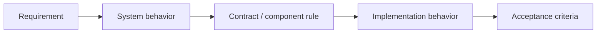

# 03 · Specification

[Русская версия](README.ru.md)

Specification is the stage where a system solution becomes a **working interface between the analyst and the team**.

Main question:

> Is the solution explicit enough for the team to implement it without guessing about important system behavior?

SSAD does not treat specification as one universal document. It treats it as system knowledge placed with the correct owners and connected through the change context.

## Inputs

By this stage the analyst should normally know the goal, requirements, constraints, affected boundaries, responsibilities, ownership, data/state changes, interfaces, flows and resolved open questions.

## Method

1. Determine which knowledge actually needs to be documented.
2. Place each piece of knowledge with its canonical owner.
3. Separate task context from stable system knowledge.
4. Make important behavior verifiable through conditions, states, outcomes, errors and acceptance criteria.
5. Connect requirements, behavior, contracts and acceptance into one traceable change.



## Aveli example

For limited offline access, the knowledge is not forced into one feature specification:

```text
backend/access/   → authoritative access decision
frontend/offline/ → previously verified snapshot usage
system/trust/     → temporary trust rules
system/flows/     → verification → snapshot → offline use → revalidation
```

The delivery task links these canonical descriptions into one change context.

## Completion check

Before Review, confirm that scope, ownership, key scenarios, contracts, relevant state/data changes, failure cases and acceptance criteria are explicit and that unresolved critical questions are not hidden inside the specification.

Next: [`../04-review/`](../04-review/)
