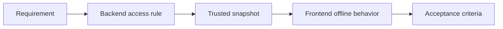

# 03 · Specification

[English version](README.md)

Specification — это этап, на котором системное решение становится **рабочим интерфейсом между аналитиком и командой**.

Главный вопрос:

> Достаточно ли точно зафиксировано решение, чтобы команда могла реализовать его без догадок о ключевом поведении системы?

## Зачем нужен этот этап

Результат анализа может быть понятен самому аналитику, но этого недостаточно.

Команде нужны явные ответы на вопросы:

- что меняется;
- где находится изменение;
- какие компоненты затронуты;
- какие данные, состояния и контракты участвуют;
- какое поведение ожидается;
- какие ограничения нельзя нарушить;
- как проверить результат.

SSAD рассматривает спецификацию не как один большой документ, а как **зафиксированное системное знание, распределённое по своим владельцам и связанное с задачей изменения**.

## Входы

Обычно к этому этапу уже известны:

- цель и контекст задачи;
- требования и ограничения;
- границы изменения;
- затронутые ответственности;
- ownership;
- модели данных и состояния;
- интерфейсы;
- сквозные сценарии;
- открытые вопросы, которые удалось закрыть.

Если ключевые части решения всё ещё неизвестны, спецификация не должна использоваться как способ скрыть эту неопределённость.

## Что делает аналитик

### 1. Определяет, какое знание должно быть зафиксировано

Не каждый change требует одинакового набора документов.

Для простого изменения может быть достаточно:

```text
behavior
+
contract
+
acceptance criteria
```

Для сложного изменения:

```text
business rule
+
state model
+
data changes
+
API contract
+
integration behavior
+
failure scenarios
+
acceptance criteria
```

### 2. Размещает знание у правильных владельцев

Например:

```text
backend/api/
→ HTTP-контракт

backend/access/
→ алгоритм определения доступа

frontend/offline/
→ клиентское поведение без сети

system/flows/
→ сквозной сценарий
```

Задача разработки может ссылаться на несколько таких источников.

### 3. Отделяет решение от контекста задачи

Полезно различать:

```text
TASK CONTEXT
Почему изменение нужно именно сейчас?

CANONICAL SYSTEM KNOWLEDGE
Как система должна работать после изменения?
```

История задачи может устареть. Каноническое системное знание должно продолжать жить после её закрытия.

### 4. Делает решение проверяемым

Для значимого поведения должны быть понятны:

- входы;
- условия;
- состояния;
- результат;
- ошибки;
- edge cases;
- acceptance criteria.

### 5. Связывает части решения

Спецификация не должна превращаться в независимые острова.

Пример:

```text
Requirement
   ↓
System behavior
   ↓
Backend rule
   ↓
API contract
   ↓
Frontend behavior
   ↓
Acceptance criteria
```

## Что не является хорошей спецификацией

### Пересказ задачи

```text
Добавить офлайн-доступ пользователям с подпиской.
```

Такой текст не объясняет систему.

### Огромный универсальный документ

```text
feature-specification.md
  business
  backend
  frontend
  database
  API
  integration
  QA
```

Он быстро превращается во второго владельца знаний, уже существующих в других областях.

### Детали без ownership

Например:

```text
Frontend решает, активна ли подписка.
Backend тоже рассчитывает доступ.
```

Спецификация должна сначала устранить конфликт ответственности.

## Пример · Aveli

Задача:

> Разрешить ограниченную офлайн-работу после успешной серверной проверки доступа.

Вместо одного feature-document знание может распределиться так:

```text
backend/access/
→ сервер остаётся владельцем итогового AccessStatus

frontend/offline/
→ клиент хранит ранее проверенный snapshot

system/trust/
→ snapshot является временно доверенным

system/flows/
→ server verification → snapshot → offline access → revalidation
```

А задача разработки связывает эти изменения в один change context.



## Результат этапа

К концу Specification должно существовать знание, достаточное для review и реализации:

```text
change context
system behavior
responsibilities
contracts
states / data changes
failure behavior
acceptance criteria
links to canonical knowledge
```

Форма может отличаться между проектами.

Важно содержание, а не наличие универсального шаблона.

## Completion check

Перед Review полезно проверить:

- [ ] цель изменения понятна;
- [ ] scope определён;
- [ ] ownership не противоречив;
- [ ] основные сценарии описаны;
- [ ] состояния и данные определены там, где нужны;
- [ ] интерфейсы имеют явные контракты;
- [ ] failure / edge cases не потеряны;
- [ ] acceptance criteria проверяемы;
- [ ] задача ссылается на каноническое знание;
- [ ] ключевых скрытых OPEN-вопросов не осталось.

Следующий этап: [`../04-review/`](../04-review/)
