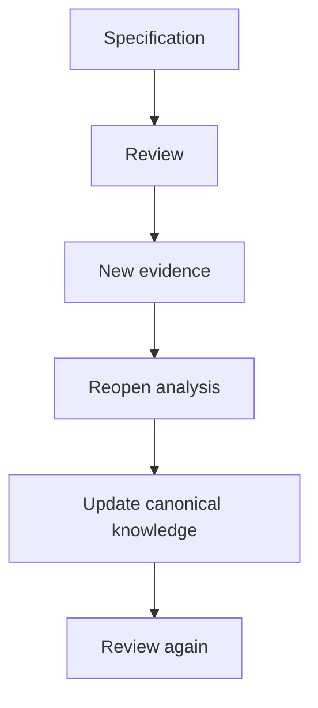

# 04 · Review

[Русская версия](README.ru.md)

Review is the stage where the solution is checked by **the combined competencies of the team**, not only by the analyst.

Main question:

> Which errors, assumptions and contradictions become visible when business, architecture, development, QA and integration owners inspect the solution from their own perspectives?

## Review focus

Different participants validate different knowledge:

| Participant | Main focus |
|---|---|
| Product / Business | intent and expected behavior |
| System Analyst | logical completeness, boundaries, ownership, traceability |
| Architect | dependencies and architectural constraints |
| Developer | feasibility and implementation evidence |
| QA | ambiguity, edge cases and verifiability |
| Integration owner | external contract and provider limitations |
| Security / Operations | trust, security and operational constraints |

Reviewers are selected from the Change Surface; not every task needs every role.

## Method

1. Determine which responsibilities are affected and therefore which reviewers are needed.
2. Start with problem, scope, affected owners and key decisions before deep technical details.
3. Review in order: intent → boundaries/ownership → behavior → contracts/data/states → failures → acceptance.
4. Classify feedback as preference, question, contradiction, new evidence or blocking issue.
5. When a decision changes, update canonical system knowledge rather than only resolving a comment thread.



## Aveli example

If a specification says an offline snapshot is valid for 72 hours, but backend review shows that the server already returns `recheckAt`, this is new ownership evidence. The model should become:

```text
Backend owns recheck deadline
→ Frontend consumes recheckAt
→ 72 hours is fallback only
→ trust rules and acceptance are updated
```

## Completion check

Required knowledge owners have participated, business intent remains intact, ownership and contracts are consistent, failures are considered, blocking issues are resolved or explicitly open, and all accepted changes are reflected in canonical knowledge.

Next: [`../05-grooming/`](../05-grooming/)
