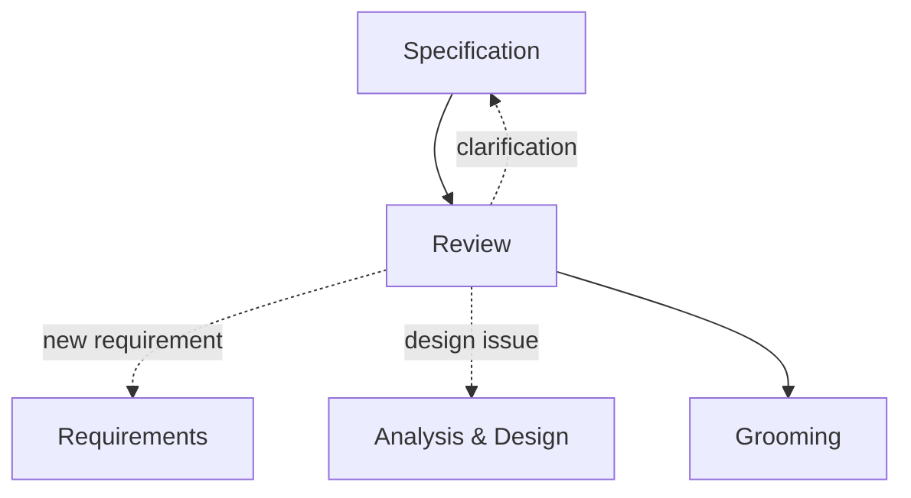

# 04 · Review

[Русская версия](README.ru.md)

Review is the stage where the analytical model is **challenged by the people who hold different pieces of system knowledge**.

It is not a spelling pass, a ritual approval, or a terminal gate after which the analysis becomes untouchable.

> **Review tests whether the proposed system model survives other system perspectives.**

## Main question

> Is the proposed behavior and system design correct, consistent, implementable and verifiable from the perspectives that matter for this change?

## Input

Review usually starts with:

- requirements and constraints;
- the relevant Analysis & Design model;
- the delivery specification;
- affected ownership and dependencies;
- contracts, states, data and flows;
- failure and compatibility behavior;
- acceptance conditions;
- known assumptions and open questions.

## Who should review

Do not invite everyone by default.

Reviewer selection follows the **affected knowledge and ownership**.

| Perspective | Typical review question |
|---|---|
| Product / Business | Did we understand the problem and intended behavior correctly? |
| Architecture | Are boundaries, responsibilities and dependencies valid? |
| Development | Is the solution implementable and compatible with current implementation evidence? |
| QA | Is behavior unambiguous, testable and complete for edge/negative scenarios? |
| Integration owner | Are contract semantics, ownership and external constraints correct? |
| Security / Operations | Are trust, failure, observability and operational behavior acceptable? |
| SA peer | Are there logical gaps, contradictions or unclear ownership? |

The important question is not “who must always attend?” but:

> **Which perspectives can invalidate a meaningful claim in this change?**

## How review works in SSAD

A comment is not merely text feedback. It may be new evidence about the system.

```text
Specification
     ↓
Review
     ├─ clarification → Specification
     ├─ missing requirement → Requirements
     ├─ design contradiction → Analysis & Design
     ├─ new implementation fact → affected canonical knowledge
     └─ validated solution → Grooming
```



This feedback loop is normal. Returning upstream means the review worked.

## Classifying feedback

A lightweight classification can help the team reason about comments:

```text
CLARIFICATION
→ wording or context is unclear

CONTRADICTION
→ two claims cannot both be true

NEW FACT
→ reviewer provides previously missing evidence

DESIGN CHANGE
→ proposed solution must change

BLOCKER
→ implementation should not start until resolved
```

These labels are optional. The useful part is distinguishing editorial feedback from information that changes the system model.

## Evidence vs authority

A reviewer may provide strong evidence without being the decision owner.

Example:

```text
Developer:
Current identity provider does not expose refresh tokens.

→ implementation evidence

Architect / system owner:
decides whether the auth model must change

→ decision authority
```

Review must preserve that distinction.

A factual contradiction is resolved by evidence. A real design choice is resolved by the appropriate authority.

See also [`../../05-collaboration/`](../../05-collaboration/).

## What gets updated

When review changes the model, update the knowledge at its canonical owner.

Do not resolve a contradiction only inside a PR comment while leaving the documentation wrong.

```text
Review finding
↓
Affected claim
↓
Canonical owner
↓
Updated model
↓
Dependent specification / acceptance / diagrams
```

## Completion check

Review is complete when:

- all critical affected perspectives have been represented;
- material contradictions are resolved;
- new evidence has been incorporated where it belongs;
- blockers are closed or explicitly prevent progression;
- target behavior remains coherent across requirements, design and specification;
- ownership and contracts are understood by the relevant owners;
- Dev can explain what will be implemented;
- QA can explain how the behavior will be verified.

The goal is not “all comments marked resolved.”

> **Review is complete when the model is sufficiently validated to become shared team knowledge.**

Next: [`05-grooming/`](../05-grooming/)
