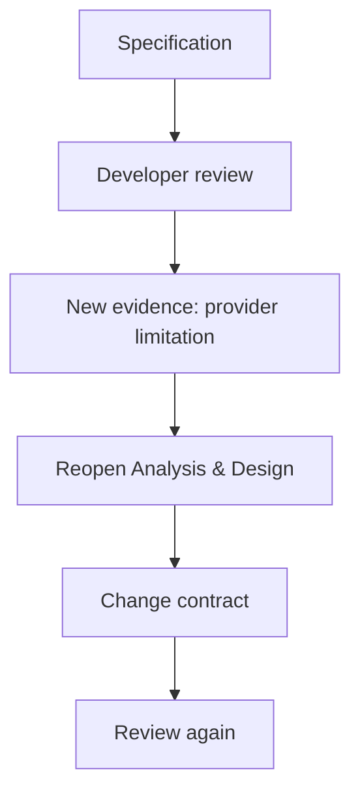

# 04 · Review

[English version](README.md)

Review — это этап, где решение проверяется **не одним аналитиком, а системой компетенций команды**.

Главный вопрос:

> Какие ошибки, допущения и противоречия становятся видны, если решение посмотреть с точки зрения бизнеса, архитектуры, разработки, QA и владельцев интеграций?

## Что проверяет Review

Review не должен сводиться к фразе «посмотрите документ».

Разные участники проверяют разные части решения:

| Участник | Основной фокус |
|---|---|
| Product / Business | правильно ли понята задача и ожидаемое поведение |
| System Analyst | логическая полнота, границы, ownership, трассируемость |
| Architect | допустимость зависимостей и архитектурных решений |
| Developer | реализуемость, технические ограничения, существующее поведение |
| QA | проверяемость, граничные сценарии, неоднозначности |
| Integration owner | корректность внешнего контракта и ограничений |
| Security / Operations | доверие, безопасность, эксплуатационные ограничения |

Не все роли обязательны для каждой задачи. Участники выбираются по Change Surface.

## Метод

### 1. Определить, чьё знание затронуто

```text
Change Surface
      ↓
Affected responsibilities
      ↓
Required reviewers
```

### 2. Дать контекст до деталей

Review должен начинаться не с сотни строк контракта, а с:

```text
Problem
Scope
System change
Affected owners
Key decisions
```

После этого можно углубляться.

### 3. Проверить решение по слоям

Полезная последовательность:

```text
WHY
→ правильно ли решаем проблему?

BOUNDARIES / OWNERSHIP
→ правильные ли части системы меняются?

BEHAVIOR
→ однозначно ли поведение?

CONTRACTS / DATA / STATES
→ согласованы ли детали?

FAILURES
→ что происходит вне happy path?

ACCEPTANCE
→ можно ли доказать корректность результата?
```

### 4. Отделять замечание от нового факта

Комментарий может быть:

```text
Preference
Question
Contradiction
New evidence
Blocking issue
```

Особенно важен `New evidence`: он может вернуть работу назад в Requirements или Analysis & Design.

### 5. Обновить каноническое знание

Review не заканчивается ответом в комментарии.

Если решение изменилось, должны быть обновлены соответствующие знания и связи.

## Пример возврата



## Aveli example

Предположим, спецификация говорит:

> Offline snapshot действует 72 часа после серверной проверки.

На review backend-разработчик указывает, что сервер уже возвращает собственный `recheckAt`.

Это не просто stylistic comment. Это новый факт о владельце правила.

Корректная реакция:

```text
Backend owns recheck deadline
        ↓
Frontend consumes recheckAt
        ↓
72 hours remains only fallback
        ↓
trust model and acceptance criteria updated
```

## Типичные ошибки

- отправить на review весь репозиторий без change context;
- подключить всех участников независимо от scope;
- воспринимать review как approval текста, а не проверку решения;
- исправить комментарий локально, но не обновить канонический источник;
- спорить о форме раньше, чем проверены ownership и behavior;
- не возвращаться к analysis после появления нового факта.

## Результат этапа

К концу Review должно быть понятно:

- какие замечания приняты;
- какие решения изменились;
- какие вопросы остались OPEN;
- кто подтвердил зависимые части;
- требуется ли повторный review;
- готово ли решение к обсуждению всей delivery-командой.

## Completion check

- [ ] необходимые владельцы знаний участвовали;
- [ ] business intent не потерян;
- [ ] ownership согласован;
- [ ] контракты и состояния непротиворечивы;
- [ ] failure cases рассмотрены;
- [ ] новые факты внесены в системное знание;
- [ ] blocking issues закрыты или явно OPEN;
- [ ] acceptance criteria остаются проверяемыми.

Следующий этап: [`../05-grooming/`](../05-grooming/)
