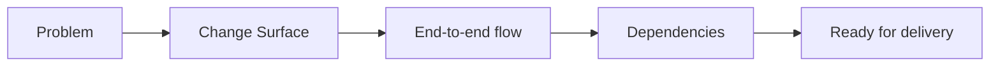

# 05 · Grooming

[Русская версия](README.ru.md)

Grooming checks not primarily whether the system solution is correct, but whether the **delivery team shares the same understanding of scope, behavior, dependencies and completion criteria**.

Main question:

> Do the analyst, developers, QA and other participants understand the upcoming implementation in the same way?

```text
REVIEW
→ is the solution correct?

GROOMING
→ does the team understand the work consistently?
```

## Method

1. Start with problem, Change Surface, affected components and expected behavior before individual implementation tasks.
2. Walk through the end-to-end behavior across components.
3. Make task and component dependencies explicit.
4. Check a minimal Ready state: purpose, scope, owners, behavior, sufficiently stable contracts, dependencies, testable acceptance and no hidden critical questions.
5. Return newly discovered questions to Analysis / Specification instead of leaving them only in meeting notes.



## Aveli example

For limited offline access, the team walks through:

```text
Backend verifies access
→ returns AccessStatus + recheckAt
→ Frontend stores trusted snapshot
→ network becomes unavailable
→ Frontend checks snapshot validity
→ workspace opens or remains blocked
```

If QA asks what happens when `recheckAt` is absent and no answer exists, that is a model gap. It returns to system knowledge and the fallback rule must be made explicit.

## Completion check

The team understands purpose, scope and out-of-scope, major scenarios, dependencies, sufficiently stable contracts and acceptance behavior. Critical unknowns are explicit, and implementation can be decomposed without relying on hidden assumptions.

Next: `06-delivery-support/`.
