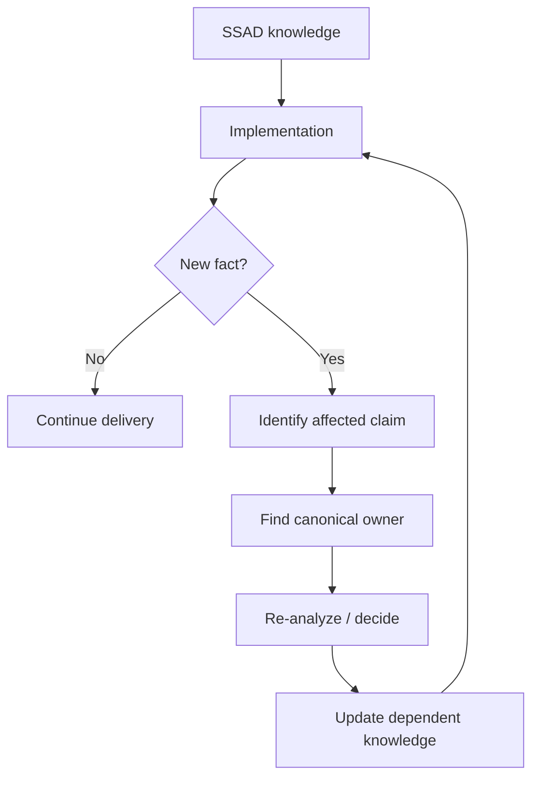

# 06 · Delivery Support

[Русская версия](README.ru.md)

Delivery Support begins when implementation starts.

Its core idea is:

> **Implementation is not only a consumer of analytical knowledge. It is also a source of new evidence about the system.**

## Main question

> What should the system analyst do when implementation reveals new questions, constraints or facts?

During delivery the team may discover hidden dependencies, technical constraints, contract mismatches, undocumented behavior, invalid assumptions or implementation details that change the analytical model.

```text
Specification
    ↓
Implementation
    ↓
New evidence
    ↓
Re-analysis if needed
    ↓
Knowledge update
```

## Input

Delivery Support starts from a groomed change with:

- understood target behavior;
- defined scope and non-goals;
- identified affected responsibilities;
- relevant contracts, states and data changes;
- known dependencies;
- acceptance criteria;
- unresolved questions that were explicitly accepted as non-blocking.

## What the system analyst does

The analyst does not simply answer implementation questions ad hoc.

For each meaningful new fact:

1. understand what was discovered;
2. separate implementation detail from system-level evidence;
3. identify which analytical claim may no longer be true;
4. find its canonical owner;
5. evaluate impact on requirements, design, contracts, states, data and acceptance;
6. involve the appropriate decision owner if a choice is required;
7. update the solution and dependent knowledge;
8. make the answer visible to the rest of the team.

## Classifying implementation feedback

```text
CLARIFICATION
→ existing model is correct, but the team needs context

NEW FACT
→ implementation reveals previously unknown system behavior

CONSTRAINT
→ a technical or external limitation affects the solution

CONTRADICTION
→ implementation evidence conflicts with documented knowledge

DESIGN CHANGE
→ the agreed solution must be changed
```

The classification is less important than the consequence: does this information change canonical system knowledge?

## Example

Specification says:

```text
Backend stores and refreshes provider refresh tokens.
```

Developer discovers:

```text
Current identity provider never exposes refresh tokens to this application.
```

A weak response is:

```text
Developer and analyst agree on a workaround in chat.
```

A stronger SSAD response is:

```text
Implementation evidence
↓
Auth assumption invalidated
↓
Auth model reopened
↓
Affected contract / state behavior updated
↓
Specification and QA scenarios updated
↓
Team continues with one current model
```

The developer provided evidence. The appropriate owner still decides the revised design.

## Reopening earlier stages

Delivery Support may reopen:

- [`01-requirements/`](../01-requirements/) when implementation exposes a missing or contradictory requirement;
- [`02-analysis-and-design/`](../02-analysis-and-design/) when boundaries, ownership, state, data or contracts must change;
- [`03-specification/`](../03-specification/) when the delivery projection is incomplete or outdated;
- [`04-review/`](../04-review/) when a material design change needs renewed validation;
- [`05-grooming/`](../05-grooming/) when the team must resynchronize around a changed solution.

This is a normal feedback loop, not a workflow failure.



## What should not happen

### Private answers become the real specification

If the same question is answered repeatedly in chat, the knowledge is probably missing from its canonical location.

### Implementation silently overrides the model

A convenient implementation choice is not automatically a new system decision.

### Documentation is updated only at the end

When a material fact changes during delivery, leaving the old model active for weeks makes the team work against two versions of reality.

### Every coding detail becomes analytical knowledge

Only preserve details that explain system behavior, constraints, ownership, interfaces, important technology responsibility or future change impact.

## Completion check

Delivery Support is healthy when:

- implementation questions receive consistent answers;
- meaningful new evidence is not lost in chat or local code context;
- contradictions reopen the correct knowledge rather than being patched locally;
- decision authority remains explicit;
- changed assumptions propagate to dependent contracts, acceptance and QA scenarios;
- canonical knowledge tracks material changes while implementation is still active;
- the team continues from one coherent system model.

Next: [`07-verification/`](../07-verification/)
