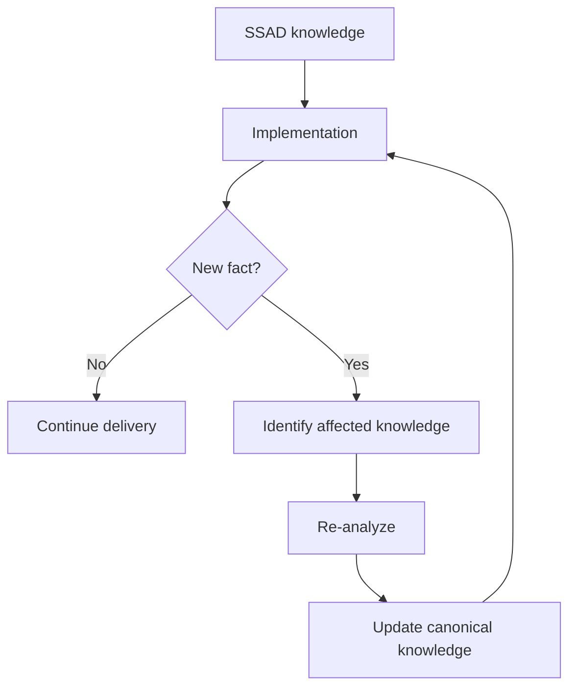

# 06 · Delivery Support

[Русская версия](README.ru.md)

Delivery Support begins when implementation starts.

Its core idea is:

> Implementation is not only a consumer of analytical knowledge. It is also a source of new evidence about the system.

## Main question

> What should the system analyst do when implementation reveals new questions, constraints or facts?

During delivery the team can discover hidden dependencies, technical constraints, contract mismatches, undocumented behavior and invalid assumptions.

```text
Specification
    ↓
Implementation
    ↓
New evidence
    ↓
Re-analysis if needed
    ↓
Knowledge update
```

The analyst classifies the new information, identifies which knowledge owner is affected, evaluates impact, involves the required decision owners, and updates canonical knowledge when the system model changes.



Delivery Support can reopen Requirements, Analysis & Design, Specification, Review or Grooming. This is a normal feedback loop rather than a workflow failure.

The stage is successful when the team receives answers, new evidence is not lost, the solution remains consistent, and canonical knowledge is updated when reality changes.

Next: [`07-verification/`](../07-verification/)
