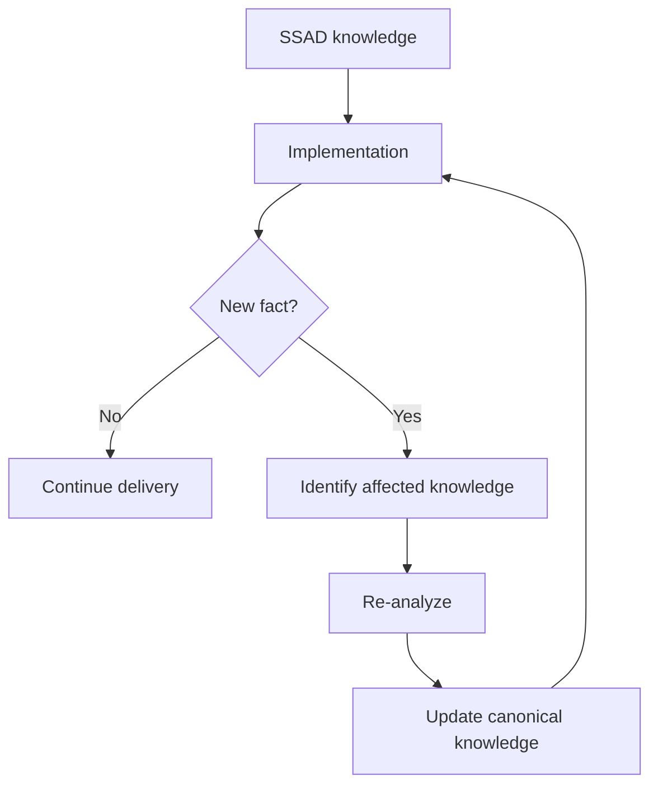

# 06 · Delivery Support

Этап **Delivery Support** начинается после того, как команда взяла задачу в реализацию.

Главная идея SSAD здесь проста:

> Реализация — не только потребитель аналитического знания. Она также источник новых фактов о системе.

## Главный вопрос

> Что должен делать системный аналитик, когда разработка уже началась, но в процессе появляются вопросы, ограничения и новые факты?

## Почему аналитическая работа не заканчивается после grooming

Во время реализации команда может обнаружить то, чего не было видно раньше:

- техническое ограничение;
- несовпадение фактического поведения системы с документацией;
- неизвестную зависимость;
- проблему интеграции;
- невозможность реализовать согласованный контракт;
- скрытый edge case;
- конфликт между компонентами;
- неверное предположение анализа.

Поэтому SSAD рассматривает разработку как часть цикла проверки системного знания.

```text
Specification
    ↓
Implementation
    ↓
New evidence
    ↓
Re-analysis if needed
    ↓
Knowledge update
```

## Что входит на этап

Обычно к началу Delivery Support уже существуют:

- согласованный scope;
- требования;
- системное решение;
- контракты и модели;
- декомпозиция задач;
- результаты review и grooming;
- известные ограничения и открытые риски.

## С кем взаимодействует SA

В первую очередь:

- backend/frontend/mobile developers;
- QA;
- architects;
- DevOps/SRE;
- owners of integrations;
- security;
- product/business representatives, если новый факт влияет на ожидаемое поведение.

## Типичные вопросы от команды

```text
Как должно вести себя это состояние?

Что делать, если внешний сервис вернул X?

Можно ли изменить контракт?

Какой компонент владеет этим правилом?

Это edge case или отдельный сценарий?

Что важнее при конфликте двух требований?

Можно ли сохранить текущее legacy-поведение?
```

Ответ SA не должен быть только устным решением текущего вопроса.

Нужно определить:

```text
Это просто уточнение?
        ↓
Или новый системный факт?
        ↓
Если новый факт — какое знание он меняет?
```

## Метод

### 1. Классифицировать вопрос

Это может быть:

- запрос на пояснение уже принятого решения;
- неизвестный edge case;
- новый факт;
- техническое ограничение;
- противоречие;
- изменение scope;
- дефект исходного анализа.

### 2. Найти владельца знания

Нужно определить, какой участок модели затронут:

```text
requirement?
business rule?
state model?
API contract?
data ownership?
integration?
security constraint?
system flow?
```

### 3. Проверить влияние

Новый факт редко существует изолированно.

Проверяем:

- какие компоненты затронуты;
- меняются ли контракты;
- меняется ли состояние;
- нужны ли новые сценарии QA;
- меняется ли поведение клиента;
- затрагиваются ли внешние команды.

### 4. Принять решение вместе с нужными участниками

SA не обязан единолично определять техническую реализацию.

Его задача — собрать правильных владельцев решения и сохранить согласованность системы.

### 5. Обновить каноническое знание

Если решение изменилось, оно должно быть исправлено там, где им владеет система знаний.

Не следует оставлять новую истину только:

- в чате;
- в комментарии Jira;
- в устной договорённости;
- в коде без отражения в системной модели.

## Feedback loop



## Пример

Допустим, в спецификации указано:

> Backend получает refresh token от identity provider и хранит его для обновления сессии.

Во время реализации разработчик выясняет:

> Текущий identity provider вообще не возвращает refresh token в используемом flow.

Плохой вариант:

```text
Developer:
"Окей, сделаю иначе."
```

И изменение остаётся только в коде.

SSAD-подход:

```text
New evidence
↓
Auth assumption invalid
↓
Reopen authentication model
↓
Review session lifecycle
↓
Change contract / flow
↓
Update QA scenarios
↓
Update canonical auth knowledge
```

## Когда нужно вернуться назад

Delivery Support может вернуть работу к:

- Requirements — если выяснилось, что ожидание было неоднозначным;
- Analysis & Design — если неверна системная модель;
- Specification — если изменился контракт или поведение;
- Review — если изменение существенно для нескольких зон ответственности;
- Grooming — если серьёзно изменился scope реализации.

Это нормальная работа процесса, а не ошибка workflow.

## Типичные ошибки

### «Аналитик уже всё написал»

После передачи в разработку SA перестаёт участвовать.

Результат — решения начинают жить в коде и чатах отдельно от документации.

### Отвечать без обновления знания

Правильный ответ разработчику дан, но через месяц никто не может найти, почему система работает именно так.

### Любой вопрос считать изменением требований

Не каждое уточнение требует пересмотра анализа. Нужно отличать объяснение существующего решения от нового факта.

### Решать техническую реализацию вместо команды

SA отвечает за согласованность решения, а не обязательно за конкретный способ написания кода.

## Результат этапа

Delivery Support успешен, если:

```text
команда получает ответы
+
новые факты не теряются
+
системное решение остаётся согласованным
+
каноническое знание обновляется при изменениях
```

Следующий этап: [`07-verification/`](../07-verification/)
