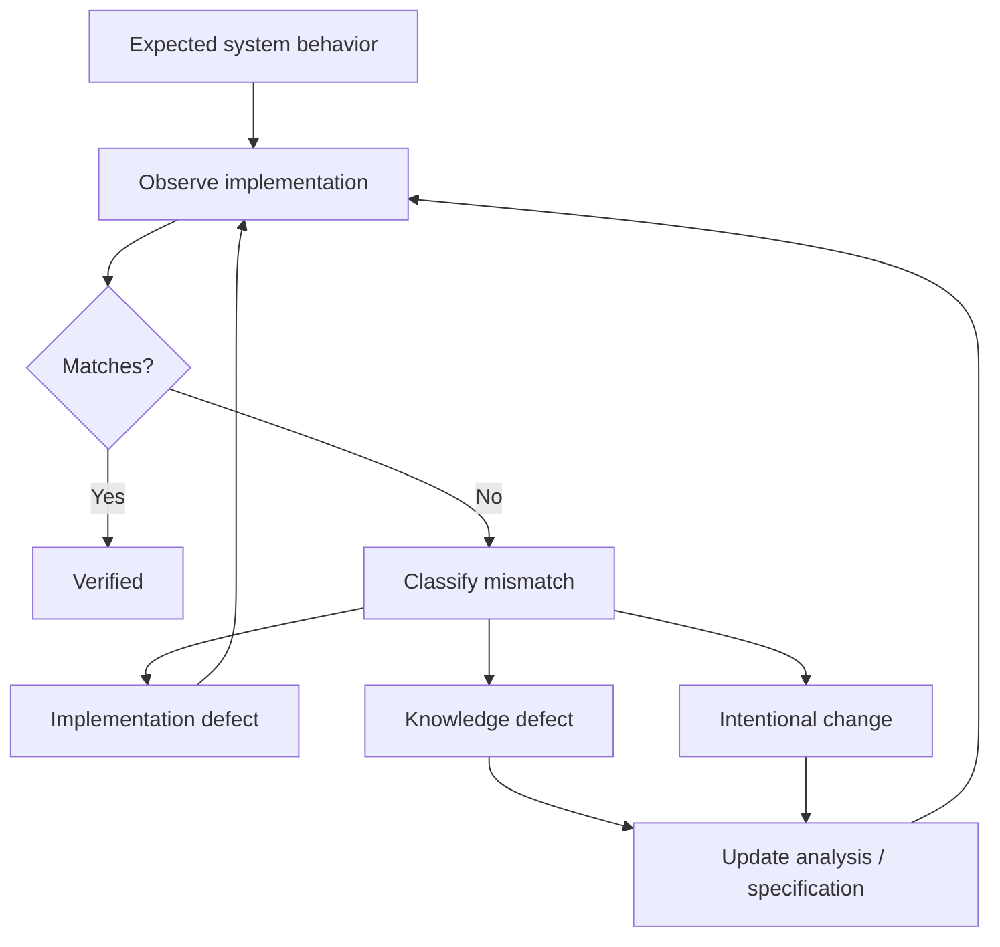

# 07 · Verification

[Русская версия](README.ru.md)

Verification asks:

> Was the system implemented the way it was understood, designed and agreed?

SSAD treats verification as consistency checking between requirements, system models, contracts, implementation and observed behavior.

```text
Requirements
↕
System model
↕
Contracts
↕
Implementation
↕
Observed behavior
```

The system analyst does not replace QA. The analyst helps verify meaning: state transitions, ownership, cross-component flows, contracts, integrations, failure behavior and system invariants.

When expected and observed behavior differ, the mismatch should be classified rather than automatically blamed on implementation:

```text
Implementation defect
Documentation defect
Analysis defect
Intentional solution change
```



The stage is complete when critical behavior is checked, important mismatches are classified and routed to the right owners, and no known contradictions between the system model and the implementation remain unresolved.

Next: [`08-knowledge-update/`](../08-knowledge-update/)
