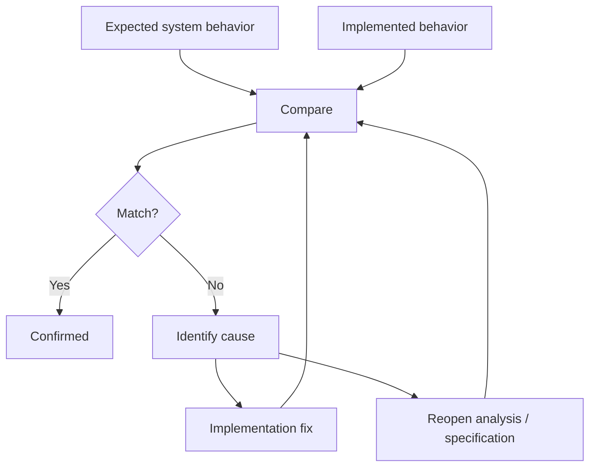

# 07 · Verification

[Русская версия](README.ru.md)

Verification compares the implemented system with the behavior that was agreed during analysis.

It is broader than “tests are green.”

> **Verification asks whether the implemented system still matches the requirements, models, contracts, states and invariants that were supposed to become true.**

## Main question

> Did we implement the intended system behavior, including its important negative paths and boundaries?

## Input

Verification uses several kinds of knowledge together:

- behavioral requirements;
- Analysis & Design decisions;
- specification and acceptance criteria;
- canonical contracts;
- state and data models;
- end-to-end and failure flows;
- trust and authority rules;
- system invariants;
- implementation evidence and test results.

No single artifact is sufficient by itself.

## What is verified

### Observable behavior

- Does the intended result occur?
- Under which conditions?
- Are prohibited outcomes prevented?

### States and transitions

- Are valid transitions possible?
- Are invalid transitions rejected?
- Does the correct owner perform each transition?

### Data

- Is canonical state stored and changed by the expected owner?
- Are migration and lifecycle rules respected?
- Does failure leave data in a valid state?

### Contracts

- Do provider and consumer agree on request, response and error semantics?
- Is compatibility behavior correct?
- Are retries, duplicates and timeouts handled as designed?

### Integrations and trust

- Is external evidence interpreted correctly?
- Does an external provider accidentally gain authority that belongs to the product?
- Does cached or offline trust expire according to policy?

### Failure behavior

- What state remains after failure?
- Can the operation be retried safely?
- Is compensation or reconciliation performed when needed?

### System invariants

The most valuable verification questions are often cross-component:

```text
Can access expire without deleting professional data?
Can duplicate billing synchronization grant access twice?
Can frontend state contradict backend authority?
Can an external webhook directly bypass the access decision model?
```

## Verification is a comparison, not a one-way QA handoff

```text
Agreed knowledge
      ↓
Implementation
      ↓
Observed behavior
      ↓
Comparison
      ├─ matches → confirmed knowledge
      └─ mismatch → investigate
                    ├─ implementation defect
                    ├─ specification defect
                    ├─ invalid assumption
                    └─ changed requirement / design
```

A mismatch does not automatically mean “developer bug.”

The implemented system may reveal that the analytical model itself was incomplete or wrong.

## Example · Aveli offline access

Agreed invariant:

```text
Access verification may expire.
Professional workspace data must remain local.
```

Verification should not stop at checking that the application displays `needsNetwork`.

It should also confirm:

```text
verification expired
→ workspace access is blocked according to policy
→ local professional data remains intact
→ successful re-verification restores access
```

If the implementation clears the local workspace when access expires, the UI may look consistent while the system invariant is violated.

## Mismatch handling

When observed behavior differs from the model:

1. record the observable mismatch;
2. identify the affected requirement, contract, state, flow or invariant;
3. determine whether implementation or analytical knowledge is wrong;
4. involve the relevant knowledge/decision owner;
5. fix the implementation or reopen the upstream model;
6. re-run affected verification;
7. update canonical knowledge if reality or the intended design changed.



## Verification and QA

QA is a major contributor to Verification, but SSAD treats verification as a system-analysis responsibility shared with the team.

QA provides strong evidence about actual behavior. The analyst helps connect that evidence back to:

- requirements;
- ownership;
- contracts;
- system states;
- cross-component invariants;
- change impact.

## Completion check

Verification is complete when:

- target behavior is demonstrated, not merely assumed from implementation;
- important negative and edge paths are checked;
- contract and state semantics match the agreed model;
- system invariants hold across component boundaries;
- discovered mismatches are resolved or explicitly reopen earlier work;
- implementation evidence is sufficient to stabilize the resulting knowledge;
- the team can state what was actually implemented, not only what was originally planned.

Next: [`08-knowledge-update/`](../08-knowledge-update/)
