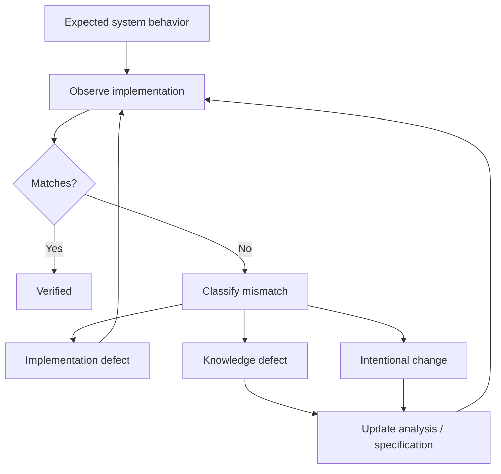

# 07 · Verification

Этап **Verification** отвечает на вопрос:

> Реализована ли система так, как она была понята, спроектирована и согласована?

В SSAD verification шире обычной проверки «задача работает».

Нужно проверить согласованность между:

```text
Requirements
↕
System model
↕
Contracts
↕
Implementation
↕
Observed behavior
```

## Что проверяет SA

Системный аналитик не заменяет QA, но помогает проверить смысл реализации.

Основные зоны:

- бизнес- и системные требования;
- состояния и переходы;
- API и event contracts;
- ownership данных и решений;
- сквозные сценарии;
- ошибки и fallback behavior;
- интеграции;
- security/trust boundaries;
- системные инварианты;
- согласованность между компонентами.

## Источники проверки

Verification может опираться на:

- результаты QA;
- тестовые стенды;
- API responses;
- логи;
- database state;
- frontend behavior;
- integration responses;
- code/implementation evidence;
- observability;
- acceptance feedback.

## Метод

### 1. Вернуться к ожидаемому поведению

Проверка начинается не с реализации, а с согласованной модели.

```text
Что должно происходить?
При каких условиях?
Кто принимает решение?
Что считается корректным состоянием?
```

### 2. Проверить критические сценарии

В первую очередь:

- happy path;
- отказ внешней зависимости;
- недоступность сети;
- повторный запрос;
- конфликт состояний;
- ошибки авторизации;
- пограничные значения;
- восстановление после ошибки.

Набор зависит от системы.

### 3. Сопоставить фактическое поведение с моделью

```text
Expected behavior
        ↕
Observed behavior
```

Если они отличаются, нужно понять источник расхождения.

### 4. Классифицировать расхождение

Возможны как минимум четыре варианта:

```text
Implementation defect
Documentation defect
Analysis defect
Intentional solution change
```

Это очень важно: не любое расхождение означает баг разработчика.

### 5. Исправить правильный источник

Если код неверен — исправляется реализация.

Если анализ был неверен — обновляется анализ и связанные знания.

Если решение сознательно изменилось — новое решение должно пройти необходимое согласование и стать каноническим.

## Схема



## Пример

Ожидаемое поведение Aveli:

> Истечение подписки запрещает создание новых защищённых действий, но не должно уничтожать локальные пользовательские данные.

QA обнаруживает:

> После reconciliation клиент очищает локальный workspace при статусе expired.

Проверка показывает:

```text
Requirement: data remains local
System invariant: access ≠ ownership of data
Implementation: local data deleted
```

Это не просто UI-баг. Нарушен системный инвариант.

Следовательно, verification возвращается к владельцам frontend/storage behavior и проверяет весь затронутый flow.

## Acceptance criteria и системная модель

Acceptance criteria полезны, но не должны быть единственным источником истины.

Они могут не покрывать:

- скрытые зависимости;
- системные инварианты;
- cross-component behavior;
- неявные последствия изменения.

Поэтому SSAD связывает acceptance с более широкой системной моделью.

## Типичные ошибки

### Проверять только happy path

Система считается корректной только в идеальном сценарии.

### Считать любой mismatch багом разработки

Иногда реализация показывает, что исходная модель была неверной.

### Не обновлять знание после фактического изменения

Команда решила изменить behavior, тесты проходят, но документация продолжает описывать старую систему.

### Проверять только локальный компонент

Изменение API может быть локально корректным, но ломать frontend, integration или system flow.

## Результат этапа

Verification завершён, когда:

- критическое поведение проверено;
- существенные расхождения классифицированы;
- дефекты направлены правильным владельцам;
- изменившееся системное знание выявлено;
- нет известных противоречий между моделью и реализованной системой, которые остаются неразобранными.

Следующий этап: [`08-knowledge-update/`](../08-knowledge-update/)
