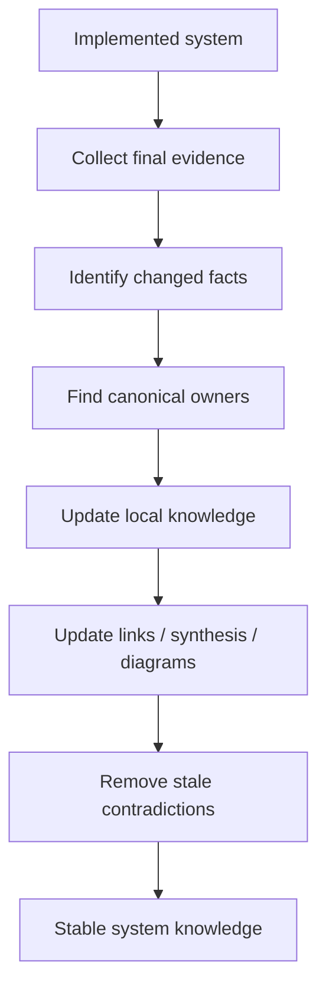

# 08 · Knowledge Update

[Русская версия](README.ru.md)

Knowledge Update closes the working cycle of a task.

Its main question is:

> What system knowledge must change after the solution has been implemented and verified?

SSAD assumes that documentation should describe the **real system**, not merely what was once planned.

Therefore the final step is to synchronize canonical knowledge with the implemented state of the system.

```text
Implemented system
        ↓
Final evidence
        ↓
Changed facts
        ↓
Canonical owners
        ↓
Updated knowledge
        ↓
Stable system view
```

The key rule is:

> Update the canonical knowledge of the affected system areas, not only the task document or delivery ticket.

This can include requirements, ownership, state models, data, contracts, integrations, system flows, invariants, constraints, operational behavior and rationale.



A task is complete from the SSAD perspective when implementation is done, behavior is verified, and canonical knowledge matches reality.

After that, the next change begins again at [`00-pre-analysis/`](../00-pre-analysis/), now using the updated system knowledge as its starting point.
