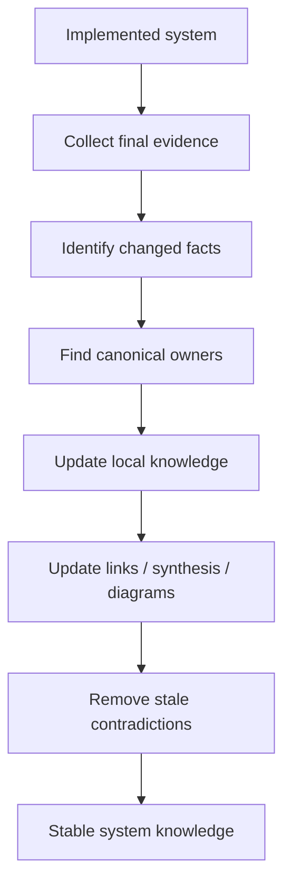

# 08 · Knowledge Update

**Knowledge Update** завершает рабочий цикл задачи.

Главный вопрос:

> Что должно измениться в системном знании после того, как решение реализовано и проверено?

SSAD исходит из того, что документация должна описывать **реальную систему**, а не историю того, что когда-то планировали реализовать.

Поэтому после delivery и verification нужно синхронизировать знания с фактическим состоянием системы.

## Что может потребовать обновления

- требования;
- business rules;
- boundaries;
- ownership;
- state models;
- data model;
- API / event contracts;
- integration behavior;
- system flows;
- invariants;
- constraints;
- operational behavior;
- known limitations;
- решения и rationale.

## Основной принцип

> Изменение должно обновлять не «документ задачи», а канонические знания тех зон системы, которые реально изменились.

Например, если изменился auth flow, недостаточно оставить финальное решение только в Jira-задаче. Должны быть обновлены канонические знания auth/session 영역ов, а при необходимости — system flow и integration contracts.

## Метод

### 1. Сравнить planned и implemented

```text
Planned solution
        ↕
Implemented solution
```

Нужно явно понять, что в процессе реализации изменилось.

### 2. Собрать факты из Delivery Support и Verification

Какие assumptions были опровергнуты?
Какие контракты поменялись?
Какие edge cases появились?
Какие решения приняли в процессе?

### 3. Найти владельцев канонического знания

Для каждого изменившегося факта определить его постоянное место.

```text
Fact
↓
Knowledge owner
↓
Canonical location
```

### 4. Обновить связанные представления

Изменение локального знания может потребовать обновить:

- cross-links;
- system synthesis;
- diagrams;
- examples;
- verification scenarios;
- change history.

### 5. Проверить отсутствие устаревшей истины

Важно не только добавить новое знание, но и убрать или явно пометить старое.

Иначе репозиторий содержит две конфликтующие версии системы.

## Схема



## Что происходит со статусом знания

Условная модель зрелости:

```text
Draft
  ↓
Reviewed
  ↓
Implemented
  ↓
Verified
  ↓
Stable
```

Название статусов может зависеть от команды. Важен сам смысл: после реализации и проверки знание получает более высокий уровень доверия.

## Пример

Во время реализации Aveli изменился способ восстановления access status после offline-периода.

Изначальная спецификация описывала один reconciliation flow, но implementation evidence показал необходимость дополнительной проверки backend state.

После реализации нужно обновить не только задачу изменения, а:

```text
backend/access/
→ access resolution

integrations/revenuecat/
→ reconciliation contract

system/flows/
→ access recovery flow

system/invariants/
→ если изменились ограничения доверия
```

Именно так системное знание продолжает отражать текущую архитектуру.

## Когда задача действительно завершена

С точки зрения SSAD задача завершена не в момент merge кода и не только после успешного QA.

Она завершена, когда:

```text
implementation is done
+
behavior is verified
+
canonical knowledge matches reality
```

## Типичные ошибки

### Оставить финальную истину в Jira

Задача закрыта, но постоянная документация не обновлена.

### Добавлять changelog вместо обновления модели

История изменений важна, но она не заменяет актуальное описание системы.

### Сохранять старое поведение рядом с новым без статуса

Читатель не понимает, какая версия является актуальной.

### Обновлять только один документ

Изменение затронуло API, state model и system flow, но исправили только API-страницу.

## Результат этапа

После Knowledge Update:

- канонические знания соответствуют реализованной системе;
- устаревшие утверждения устранены или явно историзированы;
- связанные представления согласованы;
- новые участники команды могут понять текущее состояние системы без изучения истории конкретной задачи.

## Что дальше

На этом заканчивается один рабочий цикл изменения.

Следующая задача снова начинается с [`00-pre-analysis/`](../00-pre-analysis/).

Но теперь аналитик начинает уже не с исходной системы, а с обновлённой базы системного знания.
