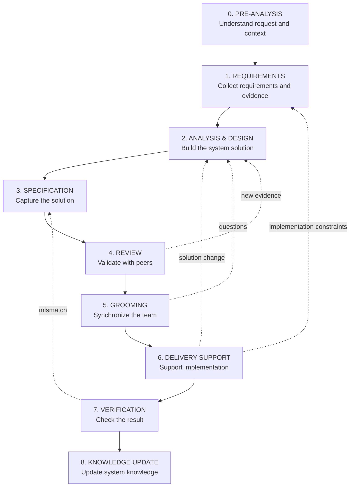

# 02 · Workflow

[Русская версия](README.ru.md)

This section answers the most practical question:

> **I received a task. What do I do as a system analyst?**

SSAD does not replace the real software delivery process with an artificial lifecycle. It explains how an analyst moves from the first request to verified and updated system knowledge.

---

## System analyst working cycle



This is not a waterfall process. A later stage may reveal new evidence and reopen requirements, analysis or specification.

---

## What SSAD adds

The working cycle itself is not unique to SSAD. SSAD connects each stage to **what system knowledge must be produced, who validates it, and where it belongs**.

| Stage | Main question | Typical result |
|---|---|---|
| **Pre-analysis** | What happened, and do we understand enough to start detailed analysis? | problem, context, initial scope, participants, unknowns |
| **Requirements** | What must the system preserve or change? | requirements, constraints, evidence, open questions |
| **Analysis & Design** | How should the change work in the system? | boundaries, ownership, data, states, interfaces, flows |
| **Specification** | What exactly should the team implement? | agreed behavior and contracts |
| **Review** | Did we miss contradictions or dependencies? | feedback, confirmation, solution changes |
| **Grooming** | Does the team understand the task consistently? | implementation readiness, unresolved questions |
| **Delivery Support** | What did implementation reveal? | answers, clarifications, new evidence, updated decisions |
| **Verification** | Does implementation match the agreed model? | confirmation or mismatches |
| **Knowledge Update** | What is now stable knowledge about the system? | updated system documentation |

---

## Standard structure of each stage

```text
Problem
↓
Inputs
↓
People
↓
Questions
↓
Method
↓
Outputs
↓
Return conditions
↓
Example
↓
Completion check
```

Each stage therefore explains not only what to do, but also what must already be known, who participates, what questions to ask, what knowledge must be created, when not to move forward, and what new facts should reopen previous work.

---

## Where system analysis happens

The deepest analytical work usually happens during Requirements and Analysis & Design, but SSAD methods appear throughout the workflow.

```text
WORKFLOW
   ↓
sets the work context
   ↓
ANALYSIS METHODS
   ↓
Boundary / Responsibility / Ownership / Data / State / Contract / Flow / Trust
   ↓
KNOWLEDGE STRUCTURE
   ↓
stores the result with the correct owner
   ↓
COLLABORATION
   ↓
the team validates and evolves the knowledge
```

Detailed methods are in [`../03-analysis/`](../03-analysis/), knowledge organization in [`../04-knowledge-structure/`](../04-knowledge-structure/), and team interaction in [`../05-collaboration/`](../05-collaboration/).

---

## Stages

### 0 · Pre-analysis

First contact with the task: understand the problem, context, potential scope, participants and unknowns before detailed requirements work begins.

→ [`00-pre-analysis/`](00-pre-analysis/)

### 1 · Requirements

Collect and validate requirements, constraints, evidence and open questions.

### 2 · Analysis & Design

Build a system solution using boundaries, responsibilities, ownership, models, interfaces and relationships.

### 3 · Specification

Capture the agreed solution in a form sufficient for implementation and verification.

### 4 · Review

Validate the solution with analysts, architects, developers, QA and dependency owners.

### 5 · Grooming

Check shared understanding of scope, behavior, constraints and acceptance before implementation.

### 6 · Delivery Support

Support implementation and process new evidence discovered during delivery.

### 7 · Verification

Check that implemented behavior and contracts preserve the agreed system model.

### 8 · Knowledge Update

Return verified knowledge to the current system documentation.

---

## Core workflow principle

> **An analytical solution is not handed to the team once and considered finished. It moves through the team, implementation and verification, accumulating evidence until it becomes stable system knowledge.**

Start: [`00-pre-analysis/`](00-pre-analysis/)
