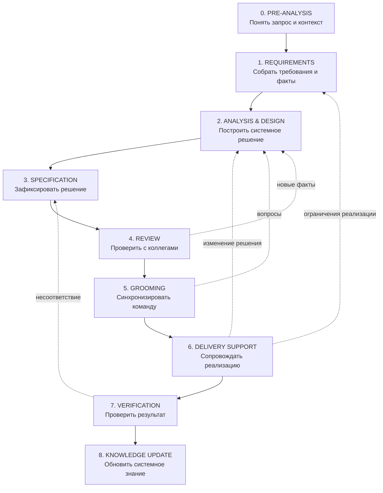

# 02 · Workflow

Этот раздел отвечает на самый практический вопрос:

> **Мне пришла задача. Что я делаю как системный аналитик?**

SSAD не заменяет реальный процесс разработки искусственным lifecycle. Она описывает, как аналитик проходит задачу от первого запроса до подтверждённого и обновлённого системного знания.

---

## Рабочий цикл системного аналитика



Этот workflow не является waterfall-процессом. Любой поздний этап может открыть новый факт, который вернёт работу к требованиям, анализу или спецификации.

---

## Что SSAD добавляет к обычному рабочему процессу

Сам по себе рабочий цикл системного аналитика не является уникальной частью SSAD. Его ценность здесь в другом: SSAD связывает каждый этап работы с тем, **какое системное знание должно появиться, кто участвует в его проверке и куда оно должно попасть**.

| Этап | Главный вопрос | Типичный результат |
|---|---|---|
| **Pre-analysis** | Что вообще произошло и стоит ли начинать детальный анализ? | проблема, контекст, первичный scope, участники, неизвестные |
| **Requirements** | Что система должна сохранять или изменить? | требования, ограничения, факты, открытые вопросы |
| **Analysis & Design** | Как изменение должно работать в системе? | границы, ownership, данные, состояния, интерфейсы, потоки |
| **Specification** | Что именно должна реализовать команда? | согласованное описание поведения и контрактов |
| **Review** | Не упустили ли мы системные противоречия? | замечания, подтверждения, изменения решения |
| **Grooming** | Одинаково ли команда понимает задачу? | готовность к реализации, выявленные вопросы |
| **Delivery Support** | Что выяснилось в ходе реализации? | ответы, уточнения, новые evidence, обновления решения |
| **Verification** | Реализация соответствует согласованной модели? | подтверждение или найденные расхождения |
| **Knowledge Update** | Что стало новым стабильным знанием о системе? | актуальная системная документация |

---

## Общая структура каждого этапа

Каждый этап в этом разделе рассматривается одинаково:

```text
Problem
↓
Inputs
↓
People
↓
Questions
↓
Method
↓
Outputs
↓
Return conditions
↓
Example
↓
Completion check
```

То есть раздел отвечает не только на вопрос «что делать», но и на:

- что должно быть известно до начала;
- с кем нужно взаимодействовать;
- какие вопросы задавать;
- какое знание создать или уточнить;
- когда нельзя двигаться дальше;
- какие новые факты должны вернуть работу назад.

---

## Где находится собственно системный анализ

Самая глубокая аналитическая работа обычно происходит на этапах Requirements и Analysis & Design, но методы SSAD используются во всём workflow.

```text
WORKFLOW
   ↓
задаёт контекст работы
   ↓
ANALYSIS METHODS
   ↓
Boundary / Responsibility / Ownership / Data / State / Contract / Flow / Trust
   ↓
KNOWLEDGE STRUCTURE
   ↓
сохраняет результат у правильного владельца
   ↓
COLLABORATION
   ↓
команда проверяет и развивает знание
```

Детальные методы находятся в [`../03-analysis/`](../03-analysis/), организация результата — в [`../04-knowledge-structure/`](../04-knowledge-structure/), взаимодействие с командой — в [`../05-collaboration/`](../05-collaboration/).

---

## Этапы

### 0 · Pre-analysis

Первое знакомство с задачей: понять проблему, контекст, потенциальный scope, заинтересованных участников и неизвестные до того, как начнётся детальный сбор требований.

→ [`00-pre-analysis/`](00-pre-analysis/)

### 1 · Requirements

Сбор и проверка требований, ограничений, фактов и открытых вопросов.

### 2 · Analysis & Design

Построение системного решения через границы, ответственность, владение, модели, интерфейсы и связи.

### 3 · Specification

Фиксация согласованного решения в форме, достаточной для реализации и проверки.

### 4 · Review

Проверка решения с другими аналитиками, архитекторами, разработчиками, QA и владельцами зависимостей.

### 5 · Grooming

Проверка общего понимания объёма, поведения, ограничений и критериев результата перед реализацией.

### 6 · Delivery Support

Поддержка разработки и обработка новых фактов, обнаруженных во время реализации.

### 7 · Verification

Проверка того, что реализованное поведение и контракты сохраняют согласованную системную модель.

### 8 · Knowledge Update

Возврат подтверждённого знания в актуальную документацию системы.

---

## Главный принцип workflow

> **Аналитическое решение не передаётся команде один раз и навсегда. Оно проходит через команду, реализацию и проверку, получая новые факты и уточняясь до стабильного системного знания.**

Начать: [`00-pre-analysis/`](00-pre-analysis/)
