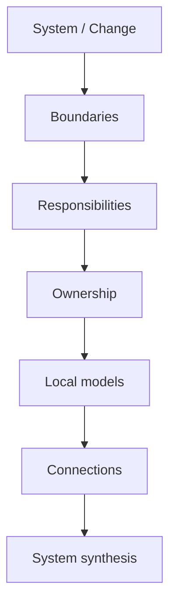

# 03 · Analysis

[Русская версия](README.ru.md)

This section contains the **analytical toolkit of SSAD**.

If [`02-workflow/`](../02-workflow/) explains what a system analyst does during real delivery, this section explains:

> **How do I decompose a system and build a coherent, verifiable solution?**

## Analysis as a reasoning path

SSAD does not prescribe a mandatory document set. It provides a sequence of system questions.



```text
1. BOUND
   What belongs to the system or change?

2. RESPONSIBILITY
   Which real responsibility areas exist?

3. OWN
   Who makes decisions and owns canonical state?

4. MODEL
   How does each responsibility area behave locally?

5. CONNECT
   How do those areas interact through interfaces, integrations and flows?

6. SYNTHESIZE
   Do the local models form one coherent system?
```

## Two analysis layers

### Structural analysis

Defines the system frame:

- boundaries;
- responsibilities;
- ownership;
- connections;
- synthesis.

### Local and cross-boundary analysis

Deepens relevant parts of the system through:

- behavior;
- states;
- data;
- interfaces;
- integrations;
- flows;
- trust;
- failures.

Local models should not be built before it is clear **whose responsibility they describe**.

## Recommended reading order

A practical route through the toolkit is:

1. [`boundaries/`](boundaries/) — define what is being analyzed;
2. [`responsibilities/`](responsibilities/) — divide the system into meaningful responsibility areas;
3. [`ownership/`](ownership/) — identify decision authority and canonical state ownership;
4. [`behavior/`](behavior/) — describe what each relevant area does;
5. [`states/`](states/) — model stable states and valid transitions where state matters;
6. [`data/`](data/) — identify canonical data, lifecycle and mutation ownership;
7. [`interfaces/`](interfaces/) — define contracts between responsibility areas;
8. [`integrations/`](integrations/) — analyze external ownership boundaries;
9. [`flows/`](flows/) — trace end-to-end behavior across multiple areas;
10. [`trust/`](trust/) — make evidence, authority and bounded trust explicit;
11. [`failures/`](failures/) — model failure, recovery, retry and reconciliation semantics;
12. [`synthesis/`](synthesis/) — verify that the local models form one non-contradictory system.

This order is a reasoning default, not a rigid waterfall. A new fact may reopen any earlier model.

## Topic standard

Each significant analytical construction is taught through the same learning pattern:

```text
Problem
→ Idea
→ Questions
→ Method
→ Result
→ Example
→ Diagram
→ Common mistakes
→ Verification
```

Next: [`04-knowledge-structure/`](../04-knowledge-structure/)
