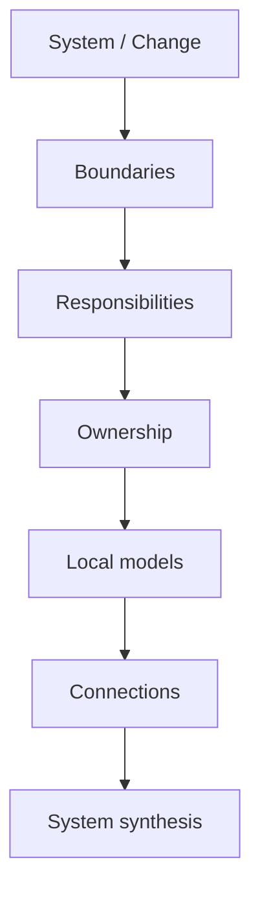

# 03 · Analysis

[Русская версия](README.ru.md)

This section contains the **analytical toolkit of SSAD**.

If [`02-workflow/`](../02-workflow/) explains what a system analyst does during real delivery, this section explains:

> **How do I decompose a system and build a coherent, verifiable solution?**

## Analysis as a reasoning path

SSAD does not prescribe a mandatory document set. It provides a sequence of system questions.



```text
BOUND
→ RESPONSIBILITY
→ OWN
→ MODEL
→ CONNECT
→ SYNTHESIZE
```

The structural layer defines boundaries, responsibilities, ownership, connections and the system view. Local analysis then deepens relevant areas through behavior, states, data, interfaces, integrations, flows, trust and failures.

Start with:

1. [`boundaries/`](boundaries/)
2. [`responsibilities/`](responsibilities/)
3. [`ownership/`](ownership/)
4. [`synthesis/`](synthesis/)

Each topic follows the same learning model: problem → idea → questions → method → result → example → diagram → mistakes → verification.

Next: [`04-knowledge-structure/`](../04-knowledge-structure/)
