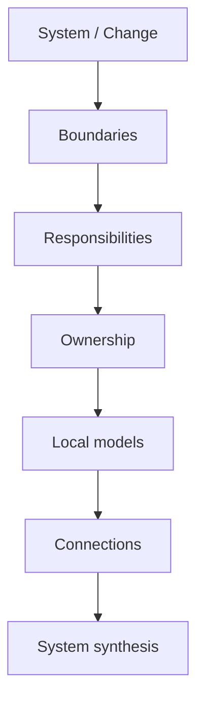

# 03 · Analysis

Этот раздел содержит **аналитический инструментарий SSAD**.

Если [`02-workflow/`](../02-workflow/) отвечает на вопрос «что делает системный аналитик на каждом этапе работы», то этот раздел отвечает:

> **Как именно разбирать систему, чтобы получить целостное и проверяемое решение?**

## Анализ в SSAD — это маршрут мышления

SSAD не предлагает обязательный набор документов. Вместо этого аналитик последовательно отвечает на системные вопросы.



Базовая логика:

```text
1. BOUND
   Что относится к системе или изменению?

2. RESPONSIBILITY
   Какие реальные зоны ответственности существуют?

3. OWN
   Кто принимает решения и владеет каноническим состоянием?

4. MODEL
   Как каждая зона ведёт себя локально?

5. CONNECT
   Как зоны взаимодействуют через интерфейсы, интеграции и потоки?

6. SYNTHESIZE
   Складываются ли локальные модели в одну непротиворечивую систему?
```

## Два уровня анализа

### Structural analysis

Определяет каркас системы:

- boundaries;
- responsibilities;
- ownership;
- connections;
- synthesis.

### Local and cross-boundary analysis

Углубляет нужные части системы через:

- behavior;
- states;
- data;
- interfaces;
- integrations;
- flows;
- trust;
- failures.

Локальные модели не должны строиться раньше, чем понятно, **чью ответственность они описывают**.

## Рекомендуемый маршрут чтения

Практический порядок работы с инструментарием:

1. [`boundaries/`](boundaries/) — определить, что именно анализируется;
2. [`responsibilities/`](responsibilities/) — разделить систему на осмысленные зоны ответственности;
3. [`ownership/`](ownership/) — определить authority решений и владельцев канонического состояния;
4. [`behavior/`](behavior/) — описать, что делает каждая значимая зона;
5. [`states/`](states/) — описать устойчивые состояния и допустимые переходы там, где состояние важно;
6. [`data/`](data/) — определить канонические данные, lifecycle и ownership изменений;
7. [`interfaces/`](interfaces/) — зафиксировать контракты между зонами ответственности;
8. [`integrations/`](integrations/) — разобрать внешние ownership boundaries;
9. [`flows/`](flows/) — проследить сквозное поведение через несколько зон;
10. [`trust/`](trust/) — явно разделить evidence, authority и ограниченное доверие;
11. [`failures/`](failures/) — описать сбои, recovery, retry и reconciliation;
12. [`synthesis/`](synthesis/) — проверить, складываются ли локальные модели в одну систему без противоречий.

Это порядок мышления по умолчанию, а не жёсткий waterfall. Новый факт может переоткрыть любой предыдущий слой.

## Стандарт темы

Каждая значимая аналитическая конструкция объясняется одинаково:

```text
Проблема
→ идея
→ вопросы
→ метод
→ результат
→ пример
→ схема
→ типичные ошибки
→ проверка
```

Следующий раздел показывает, как результаты анализа превращаются в структуру знаний: [`04-knowledge-structure/`](../04-knowledge-structure/).
