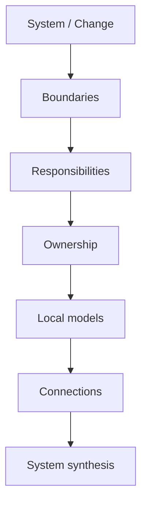

# 03 · Analysis

Этот раздел содержит **аналитический инструментарий SSAD**.

Если [`02-workflow/`](../02-workflow/) отвечает на вопрос «что делает системный аналитик на каждом этапе работы», то этот раздел отвечает:

> **Как именно разбирать систему, чтобы получить целостное и проверяемое решение?**

## Анализ в SSAD — это маршрут мышления

SSAD не предлагает обязательный набор документов. Вместо этого аналитик последовательно отвечает на системные вопросы.



Базовая логика:

```text
1. BOUND
   Что относится к системе и изменению?

2. RESPONSIBILITY
   Какие реальные зоны ответственности существуют?

3. OWN
   Кто принимает решения и владеет состоянием?

4. MODEL
   Как каждая зона ведёт себя локально?

5. CONNECT
   Как зоны взаимодействуют через данные, контракты и потоки?

6. SYNTHESIZE
   Складываются ли локальные ответы в одну непротиворечивую систему?
```

## Два уровня анализа

### Structural analysis

Определяет каркас системы:

- boundaries;
- responsibilities;
- ownership;
- connections;
- synthesis.

### Local analysis

Углубляет конкретные зоны:

- behavior;
- states;
- data;
- interfaces;
- integrations;
- flows;
- trust;
- failures.

Локальные модели не должны появляться раньше, чем понятно, **чью ответственность они описывают**.

## Ядро раздела

Начните с четырёх тем:

1. [`boundaries/`](boundaries/) — где заканчивается рассматриваемая система или изменение;
2. [`responsibilities/`](responsibilities/) — какие зоны ответственности существуют внутри границы;
3. [`ownership/`](ownership/) — кто владеет решениями и каноническим состоянием;
4. [`synthesis/`](synthesis/) — как проверить систему целиком после локального анализа.

Остальные аналитические темы будут углублять этот каркас.

## Стандарт темы

Каждая значимая конструкция объясняется одинаково:

```text
Проблема
→ идея
→ вопросы
→ метод
→ результат
→ пример
→ схема
→ ошибки
→ проверка
```

Следующий раздел показывает, как результаты анализа превращаются в структуру знаний: [`04-knowledge-structure/`](../04-knowledge-structure/).
