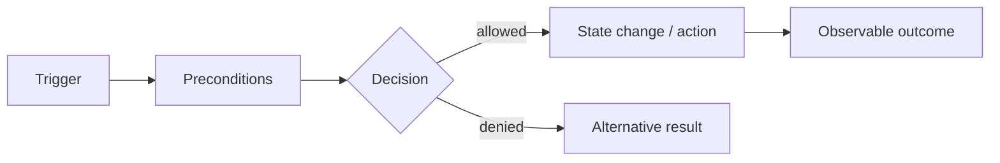

# Behavior

[Русская версия](README.ru.md)

Behavior answers:

> **What does the system do in response to an event, command or state change?**

SSAD treats behavior as observable logic inside a responsibility boundary, not as a list of screens or endpoints.

## Questions

```text
What triggers the behavior?
Who makes the decision?
Which inputs are required?
Which checks and rules are applied?
Which state is read?
Which state changes?
What outcome is observable externally?
Which alternative or error paths exist?
```

## Method

1. Capture the trigger.
2. Identify the responsibility owner.
3. Define preconditions and required data.
4. Model decisions and rules.
5. Show state changes and side effects.
6. Define the observable outcome.
7. Add alternative and failure paths.



A good behavior model lets the team explain why a result occurred, who decided it, what data mattered and what changes in alternative cases.
