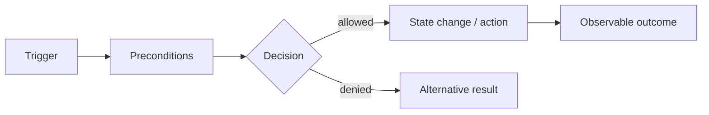

# Behavior

Поведение отвечает на вопрос:

> **Что система делает в ответ на событие, команду или изменение состояния?**

SSAD рассматривает поведение не как набор экранов или endpoint-ов, а как наблюдаемую логику внутри конкретной зоны ответственности.

## Зачем это нужно

Без явной модели поведения команда часто видит только локальные детали:

- frontend видит пользовательское действие;
- backend — обработчик;
- QA — ожидаемый результат;
- аналитик — бизнес-правило.

Но система должна иметь одно согласованное объяснение того, **что происходит от причины до результата**.

## Основные вопросы

```text
Что запускает поведение?
Кто принимает решение?
Какие входные данные нужны?
Какие проверки выполняются?
Какое состояние читается?
Какое состояние изменяется?
Какой результат наблюдаем снаружи?
Какие альтернативные и ошибочные исходы возможны?
```

## Метод

1. Зафиксировать trigger.
2. Определить responsibility owner поведения.
3. Описать preconditions и необходимые данные.
4. Выделить decision points и правила.
5. Показать изменения состояния и side effects.
6. Зафиксировать observable outcome.
7. Добавить alternative/error paths.



## Пример: Aveli access resolution

Недостаточно написать:

> Backend проверяет подписку.

Нужно раскрыть поведение:

```text
Request requires protected capability
↓
Backend identifies account
↓
Backend reads canonical access state
↓
Rules evaluate active / grace / expired / blocked
↓
Access decision is produced
↓
Frontend receives allowed / denied behavior
```

RevenueCat при этом может быть источником evidence о покупке, но не обязан быть владельцем итогового решения о доступе.

## Что должно получиться

Хорошая модель поведения позволяет однозначно ответить:

- почему система выдала этот результат;
- кто принял решение;
- какие данные на него повлияли;
- какие состояния были изменены;
- что произойдёт в альтернативных случаях.

## Типичные ошибки

- описывать только happy path;
- подменять поведение sequence diagram без объяснения правил;
- смешивать несколько responsibility zones в одну локальную модель;
- описывать технические вызовы, но не decision logic;
- считать UI реакцией всей моделью поведения.

## Проверка

Модель достаточно полна, если другой участник команды может по ней объяснить один и тот же сценарий без скрытых предположений.
