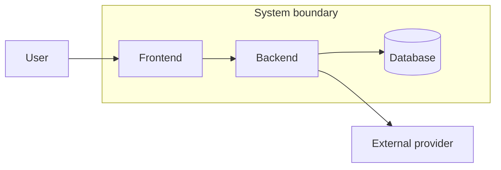

# Boundaries

[Русская версия](README.ru.md)

## Problem

Analysts often model details before defining what exactly is being analyzed. That causes internal components, external systems, adjacent teams and change scope to blur together.

## Idea

A boundary explicitly defines the system, component or change area under analysis.

> **What belongs to our analysis and what remains an external dependency?**

## Questions

- what is the object of analysis;
- what is inside it;
- what is outside it;
- which external actors affect behavior;
- where responsibility ends;
- which neighboring systems are only contract providers;
- what part of the system is affected by the current change.

## Method

1. Describe the object of analysis in one sentence.
2. Identify users and external systems.
3. Separate internal components from external dependencies.
4. For change work, define an initial change surface.
5. Check that you are not modeling internals owned by another system.

## Aveli example

RevenueCat participates in Aveli billing flows, but its internal payment behavior is outside the Aveli system boundary. Aveli owns how external billing evidence is reconciled into its own access state.

## Common mistakes

- treating any architecture diagram as a valid boundary;
- placing an external system inside the boundary because it participates in a flow;
- confusing system boundary with change boundary;
- designing APIs or storage before defining scope.

## Verification

A boundary is useful when the analyst can state what is inside, what is outside, how external systems connect, and what part is affected by the current task.

Next: [`../responsibilities/`](../responsibilities/).
