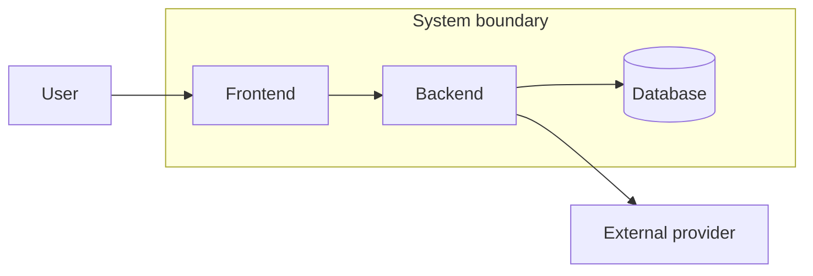

# Boundaries

## Проблема

Аналитик легко начинает моделировать детали до того, как понял, **что именно он анализирует**. Тогда в одну задачу попадают соседние сервисы, внешние интеграции, клиентские приложения и организационные процессы, хотя ответственность за них различается.

## Идея

Boundary — это явная граница рассматриваемой системы, компонента или изменения.

Граница отвечает не на вопрос «что существует вокруг», а на вопрос:

> **Что входит в нашу область анализа и что остаётся внешней зависимостью?**

## Основные вопросы

- что является объектом анализа;
- что находится внутри него;
- что находится снаружи;
- какие внешние участники влияют на поведение;
- где проходит граница ответственности;
- какие соседние системы только предоставляют контракт;
- какую часть системы затрагивает конкретное изменение.

## Метод

1. Сформулируйте объект анализа одним предложением.
2. Назовите пользователей и внешние системы.
3. Отделите внутренние компоненты от внешних зависимостей.
4. Для change-задачи выделите initial change surface.
5. Проверьте, не описываете ли вы детали системы, которой не владеете.



В примере external provider влияет на систему, но не является её внутренней зоной ответственности.

## Пример: Aveli

Для профессионального workspace граница не должна автоматически включать RevenueCat как внутренний компонент Aveli.

Aveli владеет тем, **как интерпретировать полученный billing status и преобразовать его в access decision**. RevenueCat владеет своей платёжной системой и её внутренним поведением.

```text
Aveli responsibility:
RevenueCat result → reconciliation → access state

External responsibility:
как RevenueCat проводит покупку внутри собственной платформы
```

## Типичные ошибки

- считать архитектурную диаграмму границей сама по себе;
- включать внешнюю систему внутрь только потому, что она участвует во flow;
- смешивать system boundary и change boundary;
- начинать API/DB design до определения рассматриваемой области.

## Проверка

Граница определена достаточно хорошо, если аналитик может явно сказать:

```text
Мы анализируем X.
Внутри находятся A, B, C.
Снаружи находятся D и E.
С D и E мы работаем через такие-то контракты.
Текущее изменение затрагивает A и B, но не C целиком.
```

Следующая тема: [`../responsibilities/`](../responsibilities/).
