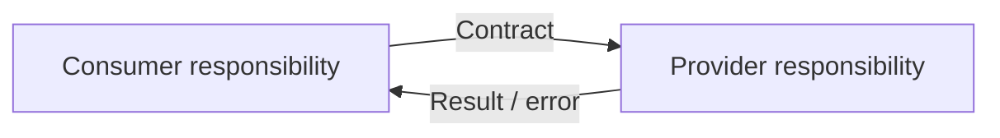

# Interfaces

Интерфейсы отвечают на вопрос:

> **Как две зоны ответственности обмениваются данными, командами или результатами и какой контракт существует между ними?**

SSAD рассматривает interface как границу между ответственностями. Это может быть HTTP API, событие, функция, файл, очередь, IPC, локальный repository contract или другой способ взаимодействия.

## Почему interface — это не просто API

Технология передачи вторична. Важнее понять:

```text
кто инициирует
кто отвечает
что передаётся
кто владеет смыслом полей
какие гарантии действуют
какие ошибки возможны
что считается совместимостью
```

## Основные вопросы

```text
Какие responsibility zones соединяет интерфейс?
Кто consumer, а кто provider?
Кто владеет контрактом?
Какова семантика запроса / события?
Какие данные обязательны?
Какие состояния и правила скрыты за контрактом?
Как выражаются ошибки?
Есть ли idempotency, ordering, retries, timeout?
Как версионируется контракт?
Что считается breaking change?
```

## Метод

1. Определить две стороны границы.
2. Зафиксировать цель взаимодействия.
3. Определить owner контракта и семантики.
4. Описать вход и выход через meaning, а не только schema.
5. Зафиксировать success и error semantics.
6. Описать temporal guarantees: timeout, retry, ordering, idempotency.
7. Определить правила совместимости и изменения.



## Пример: Aveli

Frontend может запрашивать текущий access status у backend.

Плохое описание:

```text
GET /access
200 { status: "active" }
```

Хороший анализ дополнительно отвечает:

```text
Backend owns access decision.
Frontend consumes the decision.
status reflects canonical backend state.
Client cannot promote itself to ACTIVE.
Denied / expired / unavailable states have explicit semantics.
```

То есть JSON schema является лишь частью интерфейса.

## Interface vs Integration vs Flow

```text
Interface
= контракт одной границы

Integration
= взаимодействие с внешней системой / отдельной ownership boundary

Flow
= сквозной сценарий через несколько responsibility zones и interfaces
```

Разделение важно: один flow может использовать несколько interfaces, а одна integration может содержать несколько контрактов.

## Типичные ошибки

- описывать только URL и JSON;
- не определить владельца semantics;
- считать HTTP status полной error model;
- игнорировать retries и duplicate requests;
- смешивать внутренний interface и external integration;
- описывать один endpoint без связи с behavior и ownership.

## Проверка

Интерфейс достаточно описан, если обе стороны одинаково понимают:

```text
purpose
semantics
input/output
owner
success
errors
guarantees
compatibility
```
