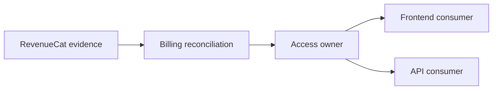

# Ownership

[Русская версия](README.ru.md)

## Problem

Even well-defined responsibility areas can conflict when it is unclear who owns a decision or authoritative state.

## Idea

Ownership identifies the canonical owner of an important system fact, decision or state.

> **Important knowledge should have one owner even when many parts of the system consume it.**

## Five core questions

```text
Who makes the decision?
Who stores authoritative state?
Who may mutate it?
Who consumes the result?
Who verifies correctness?
```

## Method

1. Select one specific fact or decision.
2. Identify the component or responsibility area allowed to determine its true value.
3. Separate evidence providers from decision owners.
4. Define allowed writers and consumers.
5. Verify that neighboring areas reference the owner instead of creating competing truth.



An external provider may supply evidence without owning the system's internal decision.

## Aveli example

RevenueCat supplies purchase evidence. Billing reconciles it. Access owns the final access state. Frontend consumes the result.

This avoids the misleading statement “RevenueCat determines access.”

## Canonical knowledge owner

Ownership also applies to documentation. If a rule is canonically owned by `backend/access/`, other documents may repeat brief context but should link back to the canonical source.

```text
Do not duplicate knowledge.
Duplicate context only when useful.
```

## Common mistakes

- confusing a data source with the decision owner;
- treating a consumer as owner because it displays state;
- allowing multiple components to independently calculate the same truth;
- storing the same rule in several documents without a canonical source;
- defining ownership by team name instead of system responsibility.

## Verification

For every important decision there should be an unambiguous chain:

```text
Evidence
→ Decision owner
→ Canonical state / rule
→ Consumers
```

If “who ultimately decides?” has two independent answers, ownership is unresolved.

Continue with local models and then [`../synthesis/`](../synthesis/).
