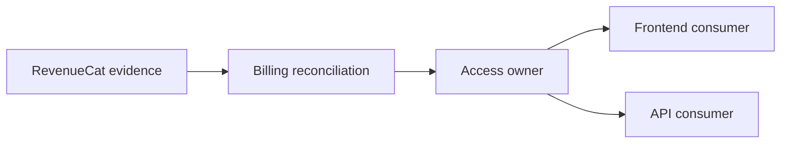

# Ownership

## Проблема

Даже хорошо выделенные зоны ответственности могут конфликтовать, если непонятно, **кто владеет решением и каноническим состоянием**.

Типичный симптом:

```text
Frontend считает одно.
Backend считает другое.
Billing присылает третье.
Документация повторяет все три версии.
```

## Идея

Ownership определяет канонического владельца значимого системного факта, решения или состояния.

> **У важного знания должен быть один владелец, даже если этим знанием пользуются многие части системы.**

## Пять базовых вопросов

```text
Кто принимает решение?
Кто хранит authoritative state?
Кто может изменить его?
Кто потребляет результат?
Кто проверяет корректность?
```

## Метод

1. Выберите конкретный факт или решение.
2. Назовите компонент или responsibility zone, которая имеет право определить истинное значение.
3. Отделите источник evidence от владельца решения.
4. Определите допустимые writers и consumers.
5. Проверьте, что другие области ссылаются на владельца, а не создают собственную competing truth.



Внешний источник может поставлять evidence, но это не обязательно делает его владельцем внутреннего системного решения.

## Пример: Aveli access

Можно сформулировать так:

```text
RevenueCat
→ источник purchase/subscription evidence

Billing
→ интерпретирует и reconciles billing evidence

Access
→ владеет итоговым access state

Frontend
→ потребляет access result
```

Это позволяет избежать ложного правила «RevenueCat определяет доступ». RevenueCat влияет на решение, но canonical access decision принадлежит системе Aveli.

## Канонический owner знания

Ownership касается не только runtime state, но и документации.

Если правило определено в `backend/access/`, другие документы могут повторить краткий контекст, но должны ссылаться на canonical source.

```text
Не дублируй знание.
При необходимости дублируй только контекст.
```

## Типичные ошибки

- путать источник данных с владельцем решения;
- считать consumer владельцем только потому, что он отображает состояние;
- разрешать нескольким компонентам независимо рассчитывать одну и ту же истину;
- хранить одинаковое правило в нескольких документах без canonical source;
- определять ownership названием команды, а не системной ответственностью.

## Проверка

Для каждого важного решения должна существовать однозначная цепочка:

```text
Evidence
→ Decision owner
→ Canonical state / rule
→ Consumers
```

Если на вопрос «кто окончательно решает?» существуют два независимых ответа, ownership не определён.

После ownership можно углублять локальные модели, а затем переходить к [`../synthesis/`](../synthesis/).
