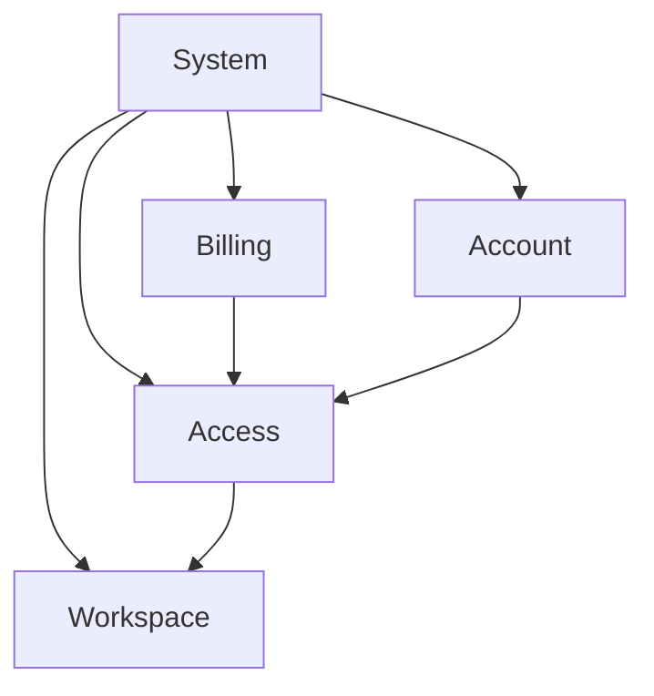

# Responsibilities

[Русская версия](README.ru.md)

## Problem

After defining a system boundary, the system may still look like one large block. Jumping directly into APIs, tables or technologies causes knowledge to be grouped by artifact type instead of real system responsibility.

## Idea

A responsibility is a stable area of system responsibility: a part of the system accountable for a distinct class of decisions, behavior or state.

> **Identify real responsibilities before deepening their technical details.**

## Questions

- what is this area responsible for;
- which decisions does it make;
- which state does it maintain;
- what does it receive;
- what does it guarantee;
- which neighboring responsibilities does it depend on;
- can its purpose be explained in one sentence.

## Method

1. Start from a defined system boundary.
2. Identify different responsibility classes rather than technologies.
3. Give each area a short purpose statement.
4. Split areas that combine independent responsibilities.
5. Only then deepen each area through behavior, data, interfaces and other local models.

`Account`, `Access`, `Billing` and `Workspace` are responsibilities, not mandatory services or document types.

## Aveli example

Inside the backend, Account, Billing and Access are distinct responsibilities. That is why access-resolution knowledge belongs to the Access area instead of a generic backend document.

## Common mistakes

- treating current deployable units as the only possible responsibility boundaries;
- using technologies as the first decomposition level;
- creating areas whose purpose cannot be stated without combining unrelated duties;
- duplicating the same decision across several areas instead of assigning ownership.

## Verification

A good responsibility area has a clear purpose, does not compete with neighboring areas for the same decision, can be deepened independently, and has explicit connections to other areas.

Next: [`../ownership/`](../ownership/).
