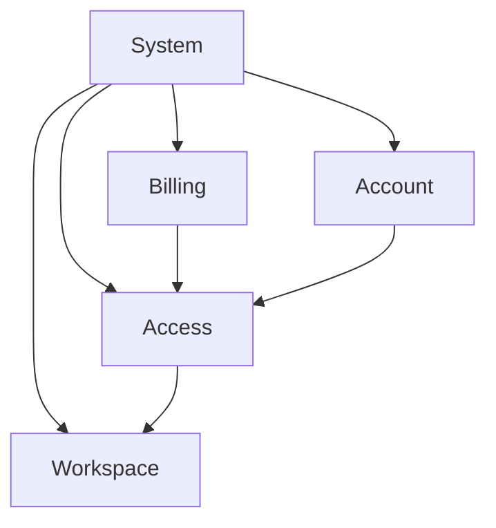

# Responsibilities

## Проблема

После определения границы система всё ещё может выглядеть как один большой блок. Если сразу переходить к API, таблицам или технологиям, знания начинают группироваться по типам артефактов, а не по реальным зонам ответственности.

## Идея

Responsibility — это устойчивая зона системной ответственности: часть системы, которая отвечает за определённый класс решений, поведения или состояния.

> **Сначала определите, какие обязанности реально существуют в системе. Только потом углубляйтесь в их внутренние детали.**

## Вопросы

- за что эта зона отвечает;
- какие решения она принимает;
- какое состояние поддерживает;
- что она получает на вход;
- что гарантирует на выходе;
- с какими соседними зонами связана;
- можно ли объяснить её назначение одним предложением.

## Метод

1. Возьмите определённую system boundary.
2. Найдите различающиеся классы ответственности, а не технологии.
3. Дайте каждой зоне короткое назначение.
4. Проверьте, не смешаны ли две независимые обязанности в одном блоке.
5. Только после этого декомпозируйте каждую зону по behavior, data, interfaces и другим локальным моделям.



Здесь `Account`, `Access`, `Billing` и `Workspace` — не типы документов и не обязательно отдельные сервисы. Это различающиеся ответственности.

## Пример: Aveli

В Aveli важно не свести всё к `backend/` и `frontend/`.

Например, внутри backend существуют разные ответственности:

```text
Account
→ identity and account lifecycle

Billing
→ reconciliation of purchase evidence

Access
→ authoritative access decision
```

Именно поэтому знание об access-resolution должно принадлежать области доступа, а не произвольному общему `backend.md`.

## Типичные ошибки

- принимать текущие deployable units за единственно возможные responsibility boundaries;
- использовать технологии как первый уровень декомпозиции;
- создавать зоны, назначение которых нельзя сформулировать без слова «и»;
- дублировать одно решение в нескольких зонах вместо определения владельца.

## Проверка

Хорошая responsibility zone:

```text
имеет понятное назначение;
не конкурирует с соседней зоной за одно и то же решение;
может углубляться независимо;
имеет явные связи с другими зонами.
```

Следующая тема: [`../ownership/`](../ownership/).
