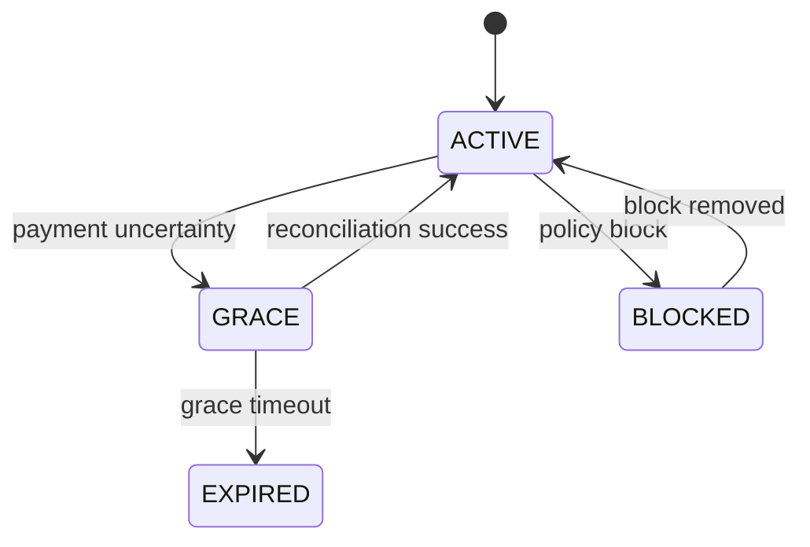

# States

[Русская версия](README.ru.md)

States answer:

> **Which stable states can an entity or process occupy, and which transitions are allowed?**

A field with an enum is not yet a state model. A useful state model makes the following explicit:

```text
state
+ transition
+ trigger
+ authority
+ guard
+ consequence
```

## Method

1. Select one stateful object.
2. Identify the authoritative state owner.
3. Define meaningful states.
4. Define trigger, actor and guard for every transition.
5. Capture side effects.
6. Mark forbidden transitions.
7. Check retries, delayed events, races and recovery paths.



A complete model lets the team explain why a transition is legal, who initiates it, who confirms it and what changes afterwards.
