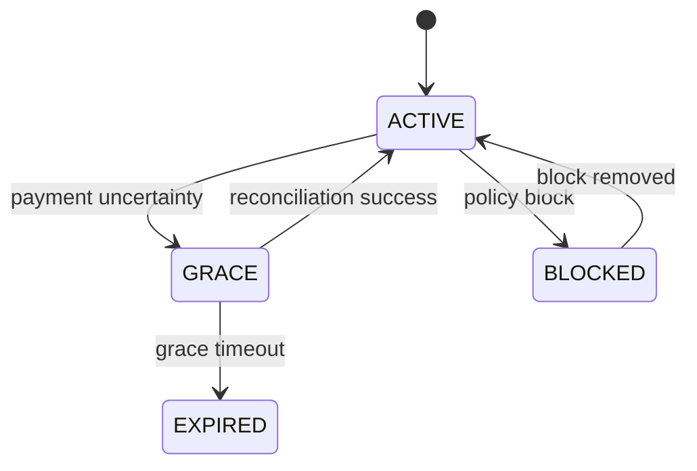

# States

Состояния отвечают на вопрос:

> **В каких устойчивых состояниях может находиться сущность или процесс и какие переходы между ними допустимы?**

## Почему это отдельная модель

Поведение объясняет действие. State model объясняет **допустимую эволюцию состояния**.

Например, `Subscription` может быть:

```text
ACTIVE
GRACE
EXPIRED
BLOCKED
```

Но список значений сам по себе ничего не говорит о допустимых переходах, причинах и последствиях.

## Основные вопросы

```text
Какой объект имеет состояние?
Кто владеет этим состоянием?
Какие состояния допустимы?
Что переводит объект между состояниями?
Кто имеет право выполнить переход?
Какие guards / preconditions действуют?
Какие переходы запрещены?
Какие side effects происходят?
Какие состояния терминальные?
```

## Метод

1. Выбрать конкретный stateful object.
2. Определить authoritative owner состояния.
3. Зафиксировать набор значимых состояний.
4. Для каждого перехода определить trigger, actor и guard.
5. Зафиксировать side effects.
6. Отметить недопустимые переходы.
7. Проверить модель на гонки, повторные события и восстановление после ошибок.



## Важный принцип

Статус в поле таблицы ещё не является state model.

State model появляется, когда понятны:

```text
state
+ transition
+ trigger
+ authority
+ guard
+ consequence
```

## Пример: Aveli

Для access lifecycle полезнее анализировать не только `access_status`, а переходы:

```text
purchase evidence
→ reconciliation
→ ACTIVE

payment uncertainty
→ GRACE

no valid entitlement after grace
→ EXPIRED
```

Так становится видно, где именно принимается решение и почему клиент не должен самостоятельно назначать себе `ACTIVE`.

## Типичные ошибки

- перечислить enum и назвать это моделью состояний;
- не определить owner переходов;
- описать только happy transitions;
- забыть повторные/запаздывающие события;
- смешать UI state и domain state;
- не определить, что происходит после рестарта или offline периода.

## Проверка

Для любого перехода команда должна уметь ответить: **почему он разрешён, кто его инициирует, кто подтверждает и что меняется после него**.
