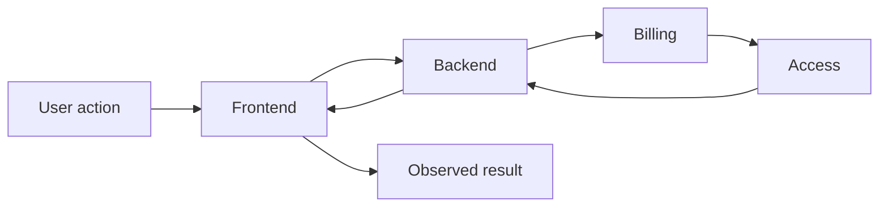

# System synthesis

[Русская версия](README.ru.md)

## Problem

Local models can be correct independently and still fail to form a correct system.

## Idea

Synthesis is the step where local knowledge is assembled back into **coherent end-to-end system behavior**.

> **Good local analysis does not automatically guarantee a good system.**

## Questions

- do local rules form one coherent flow;
- do ownership decisions match actual state transitions;
- do contracts contradict each other;
- are critical dependencies accounted for;
- can the team explain what happens end to end;
- do system invariants hold;
- what happens under failures and partial availability.

## Method

1. Select a key user or system scenario.
2. Trace it through every affected responsibility area.
3. At each transition verify owner, contract, state and failure behavior.
4. Compare local models with the end-to-end flow.
5. Feed contradictions back into local analysis.



## Aveli example

A subscription restoration scenario must be checked as one chain:

```text
purchase evidence
→ reconciliation
→ access decision
→ API response
→ client state update
→ workspace availability
```

If one transition interprets the status differently, the system is inconsistent even if each local document looks correct.

## System invariants

Synthesis is also where cross-system invariants are verified, for example:

```text
Access does not own professional data.
Logout does not delete the local workspace.
External billing evidence does not directly mutate client access state.
```

## Common mistakes

- treating a set of local documents as a complete architecture;
- checking only the happy path;
- failing to connect state transitions across responsibilities;
- treating an integration contract as sufficient end-to-end behavior;
- not reopening local analysis after a contradiction is found.

## Verification

For every key scenario, the analyst should be able to trace the end-to-end path and identify responsibility, state, contract, success behavior, failure behavior and preserved system invariants at each important step.

The result feeds back into [`02-workflow/02-analysis-and-design/`](../../02-workflow/02-analysis-and-design/) and later Specification, Review and Verification.
