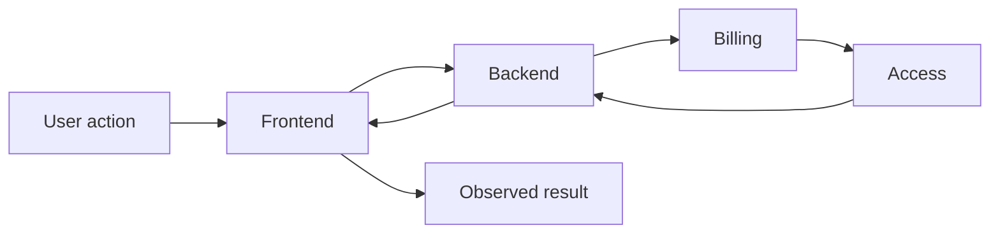

# System synthesis

## Проблема

Локальные модели могут быть корректными по отдельности и всё равно не складываться в корректную систему.

Например:

```text
Auth-модель выглядит логично.
Billing-модель выглядит логично.
Access-модель выглядит логично.

Но вместе они допускают состояние,
в котором пользователь оплачен, но доступ не восстанавливается.
```

## Идея

Synthesis — это этап, на котором аналитик собирает локальные знания обратно в **целостное системное поведение**.

> **Хороший локальный анализ ещё не гарантирует хорошую систему.**

## Вопросы

- складываются ли локальные правила в один flow;
- совпадают ли ownership и реальные переходы состояния;
- нет ли противоречий между контрактами;
- все ли критичные зависимости учтены;
- существует ли единый ответ на вопрос «что произойдёт end-to-end»;
- сохраняются ли системные инварианты;
- что происходит при ошибках и частичной недоступности.

## Метод

1. Выберите ключевой пользовательский или системный сценарий.
2. Проведите его через все затронутые responsibility zones.
3. На каждом переходе проверьте owner, contract, state и failure behavior.
4. Сопоставьте локальные модели с end-to-end flow.
5. Зафиксируйте обнаруженные противоречия как возврат в локальный анализ.



## Пример: Aveli

Для сценария восстановления подписки недостаточно иметь отдельно правильные документы по billing и access.

Нужно проверить всю цепочку:

```text
purchase evidence
→ reconciliation
→ access decision
→ API response
→ client state update
→ workspace availability
```

Если хотя бы один переход использует другое понимание статуса, система в целом противоречива.

## System invariants

Synthesis особенно полезен для проверки инвариантов.

Например:

```text
Access does not own professional data.
Logout does not delete the local workspace.
External billing evidence does not directly mutate client access state.
```

Инвариант должен выдерживаться во всех релевантных flows, а не только в одном документе.

## Типичные ошибки

- считать набор локальных документов готовой архитектурой;
- проверять только happy path;
- не связывать state transitions между зонами;
- считать integration contract достаточным описанием end-to-end behavior;
- не возвращаться к локальной модели после найденного противоречия.

## Проверка

Synthesis завершён достаточно хорошо, если для ключевых сценариев можно пройти путь end-to-end и на каждом шаге однозначно ответить:

```text
кто отвечает;
какое состояние используется;
какой контракт действует;
что происходит при успехе;
что происходит при ошибке;
какой системный инвариант должен сохраниться.
```

Результат synthesis возвращается в [`02-workflow/02-analysis-and-design/`](../../02-workflow/02-analysis-and-design/) и используется при Specification, Review и Verification.
