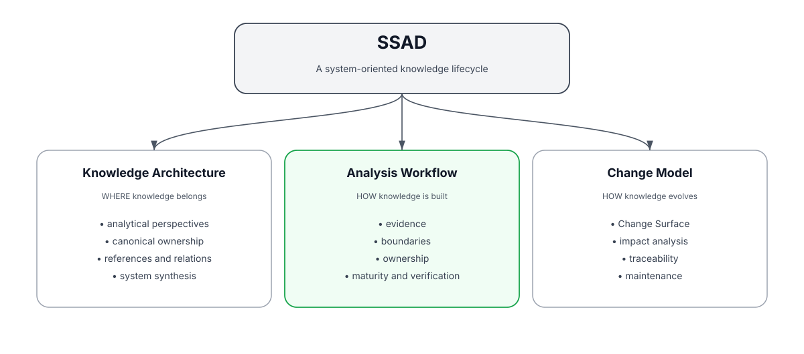
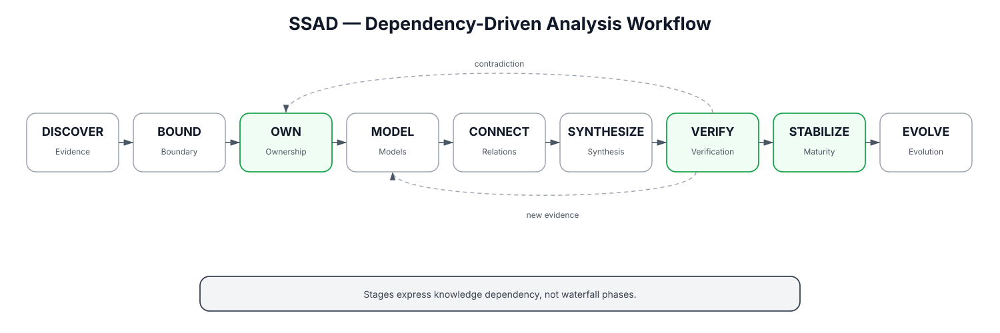

<div align="center">

# SSAD

### System-Structured Analysis Documentation

**A system-oriented methodology for building, organizing, verifying, and evolving system-analysis knowledge.**


[Русская версия](README.ru.md)

</div>

---

## The idea

Most documentation repositories are organized around **artifact types**:

```text
requirements/
diagrams/
api/
security/
database/
```

Real systems are not.

A single change can cross product rules, data ownership, interfaces, runtime components, integrations, security, acceptance, and verification.

> **SSAD organizes knowledge around the system itself: its responsibilities, boundaries, owners, dependencies, and change impact.**

<p align="center">
  
</p>

---

## Three models, one knowledge lifecycle

| Model | Question | Focus |
|---|---|---|
| **Knowledge Architecture** | Where does knowledge belong? | perspectives, canonical ownership, references, synthesis |
| **Analysis Workflow** | How is knowledge discovered and stabilized? | evidence, boundaries, ownership, modeling, verification |
| **Change Model** | How does knowledge evolve with the system? | Change Surface, impact analysis, traceability, maintenance |

SSAD is not only a repository structure and not only an analysis process. It is a way to manage **system knowledge through its lifecycle**.

---

## Examples and real-world applications

SSAD deliberately separates **examples** from **applications**.

### Examples

`examples/` contains synthetic systems created specifically to explain or exercise the methodology.

An example:

- does not need to exist as a real product;
- may use any architecture needed to illustrate a principle;
- may intentionally simplify implementation details;
- is not evidence that the described system was actually built;
- can be designed to expose a particular ownership, boundary, data, integration, or change-analysis problem.

Examples currently include:

| Example | System shape | Main SSAD idea |
|---|---|---|
| [Mobile Application](examples/mobile-application/) | client + backend + local/server data | local/server ownership and synchronization boundary |
| [Desktop Plugin](examples/desktop-plugin/) | plugin + host application + filesystem | host boundary without forced backend/frontend folders |
| [Event-Driven Platform](examples/event-driven-platform/) | services + messaging + data + operations | distributed ownership and asynchronous contracts |

### Applications

`applications/` contains **real projects actually documented using SSAD**.

Applications are practical evidence. They may reveal gaps, contradictions, or new methodology rules.

Current real-world application:

**Aveli** — local-first mobile workspace  
[`applications/aveli/`](applications/aveli/) · [full project repository](https://github.com/branch-danya-dev/aveli-system-analysis)

> **Examples illustrate SSAD. Applications exercise SSAD in real work.**

---

## Core principles

| | |
|---|---|
| **Documentation mirrors the system.** | Structure follows real responsibilities and boundaries. |
| **Ownership comes before detail.** | Contracts, schemas, states, and technology placement depend on ownership. |
| **Perspectives are required; folder templates are not.** | Different systems may require different physical structures. |
| **Canonical knowledge has one owner.** | Context may repeat; competing truth should not. |
| **Storage is hierarchical; knowledge is graph-based.** | Folders provide ownership; references express relationships. |
| **Evidence beats architectural preference.** | Existing-system truth is derived from evidence, not aesthetic preference. |
| **System documentation is a synthesis layer.** | Cross-component knowledge is synthesized rather than duplicated. |
| **Changes start with their Change Surface.** | Impact is mapped before downstream detail is rewritten. |

Full set: [`specification/core-principles.md`](specification/core-principles.md)

---

## How analysis works

<p align="center">
  
</p>

```text
DISCOVER → BOUND → OWN → MODEL → CONNECT → SYNTHESIZE → VERIFY → STABILIZE → EVOLVE
```

The sequence describes **knowledge dependencies, not waterfall phases**.

A later discovery may reopen an earlier decision. The goal is not to prevent iteration; the goal is to prevent downstream detail from being treated as stable while its upstream assumptions remain unresolved.

Detailed workflow: [`workflow/construction.md`](workflow/construction.md)

---

## Change analysis

For an existing system, SSAD begins change analysis with the **Change Surface**.

```text
Change Request
      ↓
Change Surface
      ↓
Affected Owners
      ↓
Boundary / Data / Interface Impact
      ↓
Component / Technology / Trust Impact
      ↓
Acceptance + Traceability
      ↓
Verification
      ↓
Stable
```

> **Which owners of system knowledge are affected by this change?**

Detailed process: [`workflow/change-analysis.md`](workflow/change-analysis.md)

---

## Methodology evolution

SSAD evolves through real usage and explicit decisions.

```text
Observed problem
      ↓
Example exploration and/or real application evidence
      ↓
Proposal
      ↓
Validation
      ↓
Accept / Reject / Revise
      ↓
Specification update
```

Synthetic examples help explore consequences cheaply. Real-world applications provide stronger evidence because the methodology must survive actual project constraints.

The first accepted methodology decision is:

**ADR-001 — Perspectives Over Folder Templates**

[`decisions/ADR-001-perspectives-over-folder-templates.md`](decisions/ADR-001-perspectives-over-folder-templates.md)

---

## Start here

| If you want to... | Read |
|---|---|
| understand SSAD quickly | [`specification/methodology.md`](specification/methodology.md) |
| see the principles | [`specification/core-principles.md`](specification/core-principles.md) |
| explore synthetic system shapes | [`examples/`](examples/) |
| inspect real-world usage | [`applications/`](applications/) |
| apply the construction workflow | [`workflow/construction.md`](workflow/construction.md) |
| analyze a system change | [`workflow/change-analysis.md`](workflow/change-analysis.md) |
| run a quality gate | [`workflow/verification.md`](workflow/verification.md) |
| understand evidence and maturity | [`specification/evidence-and-maturity.md`](specification/evidence-and-maturity.md) |
| follow methodology evolution | [`decisions/`](decisions/) and [`proposals/`](proposals/) |

---

## What SSAD does not replace

SSAD does not replace UML, BPMN, C4, ADRs, OpenAPI, database schemas, source code, tests, product management, operational runbooks, or architecture governance.

It defines **how those forms of knowledge can be owned, connected, constructed, verified, and evolved around the system itself**.

---

## Current maturity

```text
SSAD v0.1.2
Foundation
+ public presentation
+ examples/application separation

Synthetic examples:
mobile application
desktop plugin
event-driven platform

Real-world applications:
Aveli

Next:
additional real-world applications
→ practical playbooks
→ reusable templates
→ machine-readable metadata
→ automated consistency checks
```

> SSAD is an evolving methodology. Its individual practices are not presented as universally novel; its value is in the system-oriented combination, explicit ownership model, workflow, change model, and validation through real projects.
