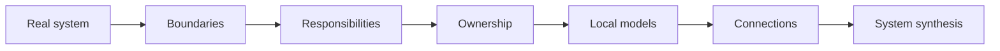
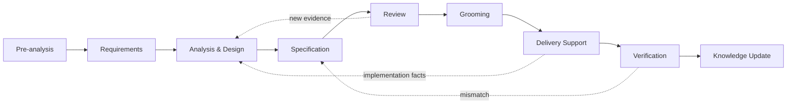
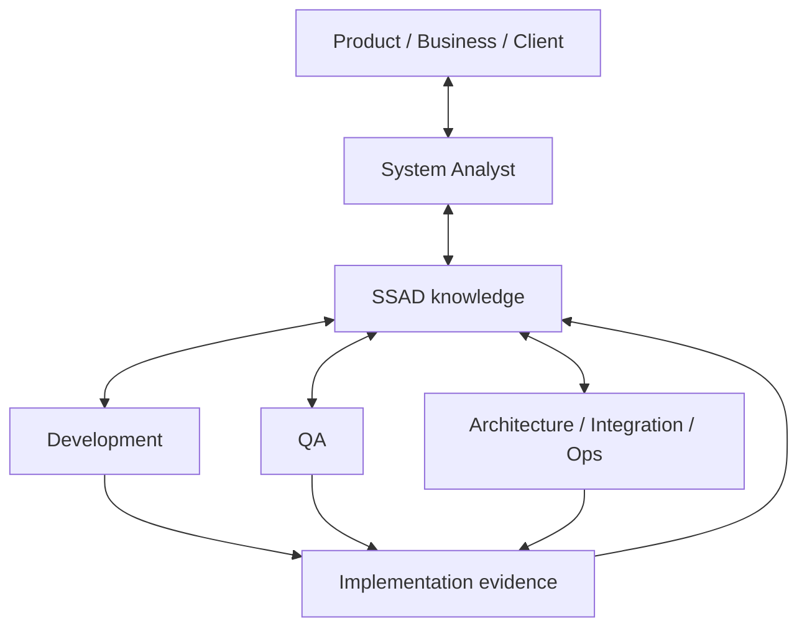

<div align="center">

# SSAD

### System-Structured Analysis Documentation

**A practical system-analysis methodology for real delivery:**  
from the first request and requirements to implementation, verification and current system knowledge.

[Русская версия](README.ru.md) · [Start with Foundation](01-foundation/README.md) · [Open Practice](07-practice/README.md) · [See real applications](08-examples/README.md)

</div>

---

> [!NOTE]
> **SSAD is not about producing documents.**  
> It is about solving system-analysis problems through the real delivery cycle, while documentation becomes the structured trace of that reasoning.

## The idea in one diagram



Core principle:

> **Structure knowledge like the system. Give important facts a canonical owner. Always reconnect local models into a coherent system view.**

SSAD does not prescribe a universal `requirements/`, `api/`, `database/`, `diagrams/` tree. The knowledge structure emerges after the real boundaries and responsibility areas of the specific system are understood.

---

## Where to start

| If you need to... | Start here |
|---|---|
| understand the approach itself | [`01 · Foundation`](01-foundation/README.md) |
| take a task from request to delivery | [`02 · Workflow`](02-workflow/README.md) |
| deeply analyze a system | [`03 · Analysis`](03-analysis/README.md) |
| decide where knowledge should live | [`04 · Knowledge Structure`](04-knowledge-structure/README.md) |
| review a solution and work with the team | [`05 · Collaboration`](05-collaboration/README.md) |
| assess the impact of a change | [`06 · Change`](06-change/README.md) |
| get a short working checklist | [`07 · Practice`](07-practice/README.md) |
| see SSAD applied to real systems | [`08 · Examples and Applications`](08-examples/README.md) |

### Recommended first read

```text
Foundation
   ↓
Workflow
   ↓
Analysis
   ↓
Knowledge Structure
   ↓
Collaboration
   ↓
Change
   ↓
Practice + Applications
```

Already working on a concrete task? You do not need to read the repository front to back. Open [`07-practice/`](07-practice/README.md) and follow the checklist into the deeper chapters you need.

---

## Real system-analyst workflow



SSAD does not replace the delivery process with its own lifecycle. It explains **what system knowledge should exist at each stage, how it should be validated and where it should live**.

---

## How SSAD analyzes a system

Once boundaries and responsibility areas are clear, the analyst deepens the relevant perspectives:

```text
Boundaries
→ Responsibilities
→ Ownership
→ Behavior
→ States
→ Data
→ Interfaces
→ Integrations
→ Flows
→ Trust
→ Failures
→ Synthesis
```

This is a default reasoning order, not a waterfall. New evidence may reopen any earlier question.

---

## Knowledge architecture

SSAD separates two different problems:

```text
HIERARCHY
→ where canonical knowledge lives

LINK GRAPH
→ how knowledge relates to other knowledge
```

> **Storage is hierarchical. Knowledge is graph-connected.**

A local document may repeat enough context to remain readable, but it should not become a second independent version of truth.

> **Do not duplicate knowledge. Duplicate context when useful.**

---

## Team ↔ SSAD



Different participants contribute different evidence and hold different authority.

A developer may be the best source for a fact about the current implementation without being the owner of the corresponding product or architecture decision. Review, grooming, implementation and QA therefore do not merely consume analysis — they can change it.

---

## Real-world validation

SSAD is currently documented against three materially different real systems.

### Aveli · product-shaped system

**[branch-danya-dev/aveli-system-analysis](https://github.com/branch-danya-dev/aveli-system-analysis)**

Aveli validates SSAD against:

- Flutter frontend and backend boundaries;
- local professional data;
- server-controlled account and access;
- RevenueCat/store billing evidence;
- bounded offline trust;
- integrations, failures and end-to-end flows.

Compact route: **[`08-examples/aveli/`](08-examples/aveli/README.md)**

```text
Repository Structure
        ↓
Access Ownership
        ↓
Offline Trust
        ↓
System Synthesis
```

### Enterprise Workplace Migration · transformation-shaped system

**[branch-danya-dev/enterprise-workplace-os-migration](https://github.com/branch-danya-dev/enterprise-workplace-os-migration)**

This application validates SSAD against a distributed enterprise migration where the system crosses workplaces, support domains, infrastructure tooling, planning and operational recovery.

Compact route: **[`08-examples/enterprise-workplace-migration/`](08-examples/enterprise-workplace-migration/README.md)**

```text
Responsibility Structure
        ↓
Global Status Decomposition
        ↓
Evidence & Readiness
        ↓
Technical Projection
```

### Rebar AutoDim · host-application automation system

**[branch-danya-dev/revit-rebar-autodim-analysis](https://github.com/branch-danya-dev/revit-rebar-autodim-analysis)**

This application validates SSAD where the analyzed system executes inside Autodesk Revit and must separate host-owned validity/mechanics from plugin-owned analytical meaning.

Compact route: **[`08-examples/revit-rebar-autodim/`](08-examples/revit-rebar-autodim/README.md)**

```text
Host Boundary
        ↓
View-Space Geometry
        ↓
Semantic Reference
        ↓
Generated Output Ownership
```

The three applications deliberately have different repository structures:

```text
Aveli
→ product-shaped ownership

Enterprise Workplace Migration
→ distributed transformation ownership

Rebar AutoDim
→ host-authority + generated-state ownership
```

> **The shared methodology appears in the reasoning model, not in a mandatory folder tree.**

---

## What SSAD does not replace

SSAD is compatible with existing engineering practices and tools.

It does not replace UML, BPMN, C4, OpenAPI, ADRs, schemas, backlog practices, user stories or a team's architecture standards.

It answers a different question:

> **How do we combine heterogeneous analytical knowledge into one coherent, navigable and maintainable model of a specific system?**

---

## Active repository structure

```text
01-foundation/          principles
02-workflow/            real SA lifecycle
03-analysis/            analytical toolkit
04-knowledge-structure/ knowledge architecture
05-collaboration/       team ↔ knowledge loop
06-change/              change mechanics
07-practice/            task-based checklists
08-examples/            examples + real-world applications
assets/                 supporting visuals
```

Historical structures remain available in Git history rather than competing with current knowledge.

---

<div align="center">

**Start:** [`01 · Foundation`](01-foundation/README.md)  
**Have a task right now:** [`07 · Practice`](07-practice/README.md)  
**Want to see real applications:** [`08 · Examples and Applications`](08-examples/README.md)  
**Contribute:** [`CONTRIBUTING`](CONTRIBUTING.md) · **Direction:** [`ROADMAP`](ROADMAP.md)

</div>
