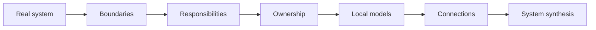
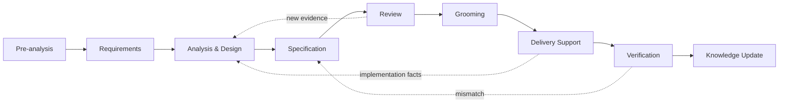
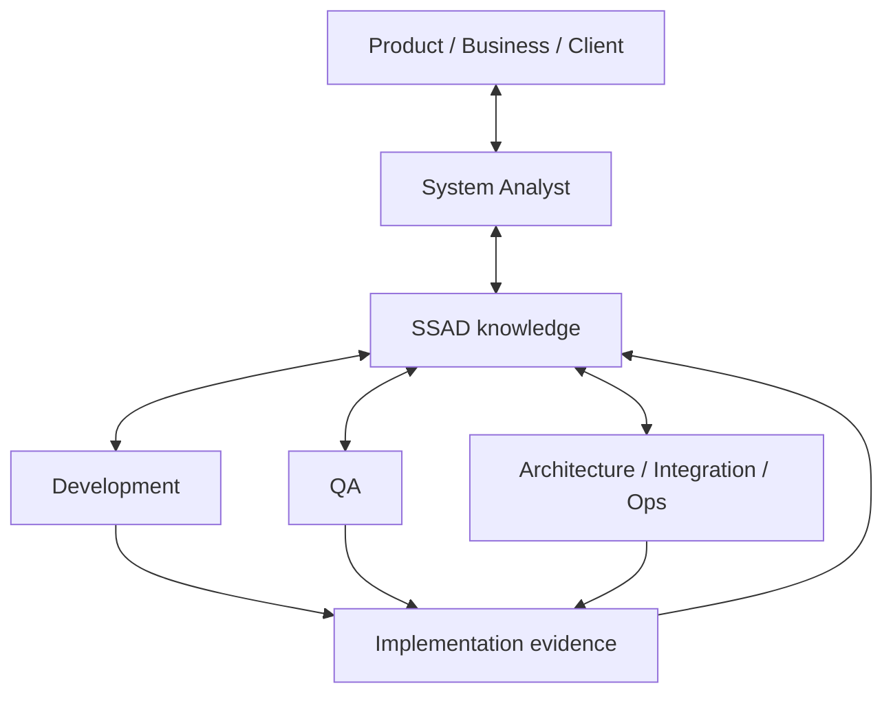

<div align="center">

# SSAD

### System-Structured Analysis Documentation

**A practical system-analysis methodology for real delivery:**  
from the first request and requirements to implementation, verification and current system knowledge.

[Русская версия](README.ru.md) · [Start with Foundation](01-foundation/README.md) · [Open Practice](07-practice/README.md) · [See Aveli](08-examples/aveli/README.md)

</div>

---

> [!NOTE]
> **SSAD is not about producing documents.**  
> It is about solving system-analysis problems through the real delivery cycle, while documentation becomes the structured trace of that reasoning.

## The idea in one diagram



Core principle:

> **Structure knowledge like the system. Give important facts a canonical owner. Always reconnect local models into a coherent system view.**

SSAD does not prescribe a universal `requirements/`, `api/`, `database/`, `diagrams/` tree. The knowledge structure emerges after the real boundaries and responsibility areas of the specific system are understood.

---

## Where to start

| If you need to... | Start here |
|---|---|
| understand the approach itself | [`01 · Foundation`](01-foundation/README.md) |
| take a task from request to delivery | [`02 · Workflow`](02-workflow/README.md) |
| deeply analyze a system | [`03 · Analysis`](03-analysis/README.md) |
| decide where knowledge should live | [`04 · Knowledge Structure`](04-knowledge-structure/README.md) |
| review a solution and work with the team | [`05 · Collaboration`](05-collaboration/README.md) |
| assess the impact of a change | [`06 · Change`](06-change/README.md) |
| get a short working checklist | [`07 · Practice`](07-practice/README.md) |
| see SSAD applied to a real system | [`08 · Examples`](08-examples/README.md) |

### Recommended first read

```text
Foundation
   ↓
Workflow
   ↓
Analysis
   ↓
Knowledge Structure
   ↓
Collaboration
   ↓
Change
   ↓
Practice + Examples
```

Already working on a concrete task? You do not need to read the repository front to back. Open [`07-practice/`](07-practice/README.md) and follow the checklist into the deeper chapters you need.

---

## Real system-analyst workflow



SSAD does not replace the delivery process with its own lifecycle. It explains **what system knowledge should exist at each stage, how it should be validated and where it should live**.

---

## How SSAD analyzes a system

Once boundaries and responsibility areas are clear, the analyst deepens the relevant perspectives:

```text
Boundaries
→ Responsibilities
→ Ownership
→ Behavior
→ States
→ Data
→ Interfaces
→ Integrations
→ Flows
→ Trust
→ Failures
→ Synthesis
```

This is a default reasoning order, not a waterfall. New evidence may reopen any earlier question.

---

## Knowledge architecture

SSAD separates two different problems:

```text
HIERARCHY
→ where canonical knowledge lives

LINK GRAPH
→ how knowledge relates to other knowledge
```

> **Storage is hierarchical. Knowledge is graph-connected.**

A local document may repeat enough context to remain readable, but it should not become a second independent version of truth.

> **Do not duplicate knowledge. Duplicate context when useful.**

---

## Team ↔ SSAD



Different participants contribute different evidence and hold different authority.

A developer may be the best source for a fact about the current implementation without being the owner of the corresponding product or architecture decision. Review, grooming, implementation and QA therefore do not merely consume analysis — they can change it.

---

## Real-world validation: Aveli

The primary real-world SSAD case is **Aveli**:

**[branch-danya-dev/aveli-system-analysis](https://github.com/branch-danya-dev/aveli-system-analysis)**

Aveli validates SSAD against a real system containing:

- a Flutter frontend;
- backend-controlled account and access;
- a local professional workspace;
- RevenueCat and store billing;
- offline trust;
- external integrations;
- failure behavior and end-to-end flows.

Start with the compact walkthrough: **[`08-examples/aveli/`](08-examples/aveli/README.md)**.

```text
Repository structure
        ↓
Access ownership
        ↓
Offline trust
        ↓
System synthesis
```

---

## What SSAD does not replace

SSAD is compatible with existing engineering practices and tools.

It does not replace UML, BPMN, C4, OpenAPI, ADRs, schemas, backlog practices, user stories or a team's architecture standards.

It answers a different question:

> **How do we combine heterogeneous analytical knowledge into one coherent, navigable and maintainable model of a specific system?**

---

## Project direction and contributions

SSAD is now in a **validation and stabilization** phase rather than a chapter-expansion phase.

- Want to contribute? Read [`CONTRIBUTING.md`](CONTRIBUTING.md).
- Want to see what “v1.0 ready” means? Read [`ROADMAP.md`](ROADMAP.md).

The central rule for future development is simple:

> **New concepts should be driven by real analytical friction and evidence, not by a desire to complete a taxonomy.**

The current v1.0 direction prioritizes a second real-world validation case, continued use on Aveli changes, terminology/navigation stability, and an intentional publication license.

---

## Active repository structure

```text
01-foundation/          principles
02-workflow/            real SA lifecycle
03-analysis/            analytical toolkit
04-knowledge-structure/ knowledge architecture
05-collaboration/       team ↔ knowledge loop
06-change/              change mechanics
07-practice/            task-based checklists
08-examples/            real-world validation
assets/                 supporting visuals
```

Historical structures remain available in Git history rather than competing with current knowledge.

---

<div align="center">

**Start:** [`01 · Foundation`](01-foundation/README.md)  
**Have a task right now:** [`07 · Practice`](07-practice/README.md)  
**Want to see a real project:** [`08 · Aveli`](08-examples/aveli/README.md)  
**Contribute:** [`CONTRIBUTING`](CONTRIBUTING.md) · **Direction:** [`ROADMAP`](ROADMAP.md)

</div>
