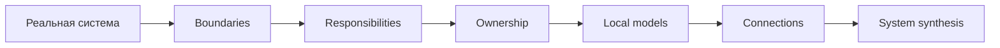
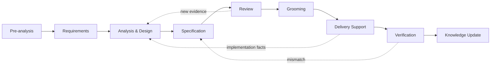
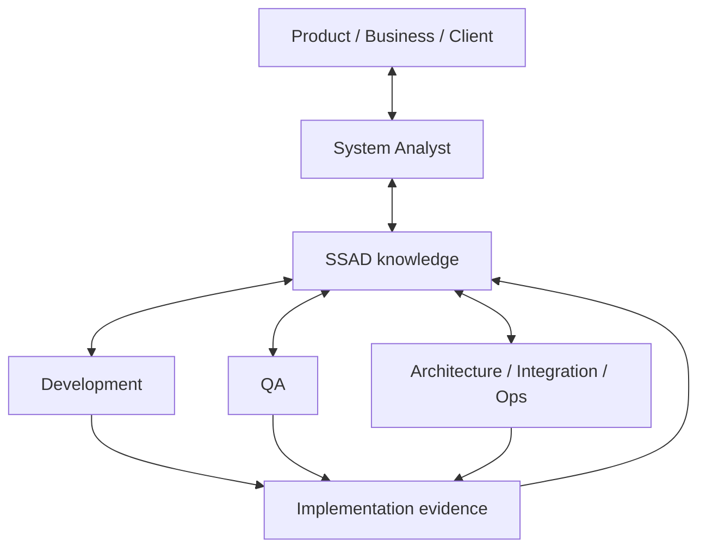

<div align="center">

# SSAD

### System-Structured Analysis Documentation

**Практическая методология системного анализа для реальной работы:**  
от первого запроса и требований — до реализации, проверки и актуального системного знания.

[English](README.md) · [Начать с Foundation](01-foundation/README.ru.md) · [Открыть Practice](07-practice/README.ru.md) · [Посмотреть реальные applications](08-examples/README.ru.md)

</div>

---

> [!NOTE]
> **SSAD учит не писать документы.**  
> SSAD учит системно решать задачи в реальном цикле разработки, а документация становится структурированным следом анализа.

## Идея в одной схеме



Главный принцип:

> **Структурируй знания так, как структурирована система. Для значимых фактов определяй канонического владельца. Локальные модели всегда собирай обратно в целостное представление системы.**

SSAD не задаёт универсальное дерево `requirements/`, `api/`, `database/`, `diagrams/`. Структура знания появляется после того, как понятны реальные границы и зоны ответственности конкретной системы.

---

## Куда идти

| Если тебе нужно... | Начни здесь |
|---|---|
| понять сам подход | [`01 · Foundation`](01-foundation/README.ru.md) |
| разобрать новую задачу от запроса до delivery | [`02 · Workflow`](02-workflow/README.ru.md) |
| глубоко проанализировать систему | [`03 · Analysis`](03-analysis/README.ru.md) |
| понять, где хранить знание | [`04 · Knowledge Structure`](04-knowledge-structure/README.ru.md) |
| провести review и работать с командой | [`05 · Collaboration`](05-collaboration/README.ru.md) |
| оценить влияние изменения | [`06 · Change`](06-change/README.ru.md) |
| получить короткий рабочий checklist | [`07 · Practice`](07-practice/README.ru.md) |
| увидеть SSAD на реальных системах | [`08 · Examples and Applications`](08-examples/README.ru.md) |

### Первый последовательный проход

```text
Foundation
   ↓
Workflow
   ↓
Analysis
   ↓
Knowledge Structure
   ↓
Collaboration
   ↓
Change
   ↓
Practice + Applications
```

Уже работаешь над конкретной задачей? Не обязательно читать всё подряд — открой [`07-practice/`](07-practice/README.ru.md) и перейди в нужную глубокую главу из checklist.

---

## Реальный workflow системного аналитика



SSAD не подменяет delivery-процесс своим lifecycle. Она показывает, **какое системное знание должно появиться на каждом этапе, как его проверить и где оно должно жить**.

---

## Как SSAD анализирует систему

После определения границ и responsibility areas аналитик последовательно углубляется в нужные перспективы:

```text
Boundaries
→ Responsibilities
→ Ownership
→ Behavior
→ States
→ Data
→ Interfaces
→ Integrations
→ Flows
→ Trust
→ Failures
→ Synthesis
```

Это default reasoning order, а не waterfall. Новый факт может переоткрыть любой более ранний вопрос.

---

## Архитектура знания

SSAD разделяет две задачи:

```text
ИЕРАРХИЯ
→ где находится каноническое знание

ГРАФ ССЫЛОК
→ как знания связаны между собой
```

> **Хранение иерархично. Знание связано графом.**

Локальный документ может повторить необходимый контекст, чтобы оставаться читаемым, но не должен становиться второй независимой версией истины.

> **Не дублируй знание. При необходимости дублируй только контекст.**

---

## Команда ↔ SSAD



Разные участники приносят разное evidence и обладают разной authority.

Разработчик может быть лучшим источником факта о текущей реализации, но не обязательно владельцем продуктового или архитектурного решения. Review, grooming, разработка и QA поэтому не завершают анализ — они могут изменить его.

---

## Проверка на реальных системах

SSAD сейчас задокументирована на двух существенно разных реальных системах.

### Aveli · product-shaped system

**[branch-danya-dev/aveli-system-analysis](https://github.com/branch-danya-dev/aveli-system-analysis)**

Aveli проверяет SSAD на:

- Flutter frontend и backend boundaries;
- локальных professional data;
- server-controlled account и access;
- RevenueCat/store billing evidence;
- bounded offline trust;
- integrations, failures и end-to-end flows.

Компактный маршрут: **[`08-examples/aveli/`](08-examples/aveli/README.ru.md)**

```text
Repository Structure
        ↓
Access Ownership
        ↓
Offline Trust
        ↓
System Synthesis
```

### Enterprise Workplace Migration · transformation-shaped system

**[branch-danya-dev/enterprise-workplace-os-migration](https://github.com/branch-danya-dev/enterprise-workplace-os-migration)**

Этот application проверяет SSAD на распределённой enterprise migration, где система проходит через рабочие места, support-домены, infrastructure tooling, planning и operational recovery.

Компактный маршрут: **[`08-examples/enterprise-workplace-migration/`](08-examples/enterprise-workplace-migration/README.ru.md)**

```text
Responsibility Structure
        ↓
Global Status Decomposition
        ↓
Evidence & Readiness
        ↓
Technical Projection
```

Два application намеренно имеют разную структуру репозиториев.

> **Общая методология проявляется в reasoning model, а не в обязательном дереве директорий.**

---

## Что SSAD не пытается заменить

SSAD совместима с существующими инженерными практиками и инструментами.

Она не заменяет UML, BPMN, C4, OpenAPI, ADR, schemas, backlog, user stories или архитектурные стандарты команды.

Она отвечает на другой вопрос:

> **Как собрать разнородные аналитические знания в целостную, навигируемую и поддерживаемую модель конкретной системы?**

---

## Развитие проекта и contributions

SSAD сейчас находится в фазе **comparative validation и stabilization**, а не бесконечного добавления новых глав.

- Хочешь участвовать в развитии? Открой [`CONTRIBUTING.ru.md`](CONTRIBUTING.ru.md).
- Хочешь понять, что именно будет означать готовность к v1.0? Открой [`ROADMAP.ru.md`](ROADMAP.ru.md).

Главное правило дальнейшего развития:

> **Новые концепты должны появляться из реальных аналитических friction points и evidence, а не из желания закончить классификацию.**

Второй существенно отличающийся real-world application теперь завершён. Следующая validation-работа — сравнивать friction points между applications, продолжать проверку на значимых изменениях, стабилизировать терминологию/навигацию и завершить publication/release hygiene.

---

## Активная структура репозитория

```text
01-foundation/          principles
02-workflow/            real SA lifecycle
03-analysis/            analytical toolkit
04-knowledge-structure/ knowledge architecture
05-collaboration/       team ↔ knowledge loop
06-change/              change mechanics
07-practice/            task-based checklists
08-examples/            examples + real-world applications
assets/                 supporting visuals
```

Исторические версии структуры остаются в Git history и не конкурируют с текущим знанием.

---

<div align="center">

**Начать:** [`01 · Foundation`](01-foundation/README.ru.md)  
**Есть задача прямо сейчас:** [`07 · Practice`](07-practice/README.ru.md)  
**Хочется увидеть реальные applications:** [`08 · Examples and Applications`](08-examples/README.ru.md)  
**Участвовать:** [`CONTRIBUTING`](CONTRIBUTING.ru.md) · **Направление:** [`ROADMAP`](ROADMAP.ru.md)

</div>
