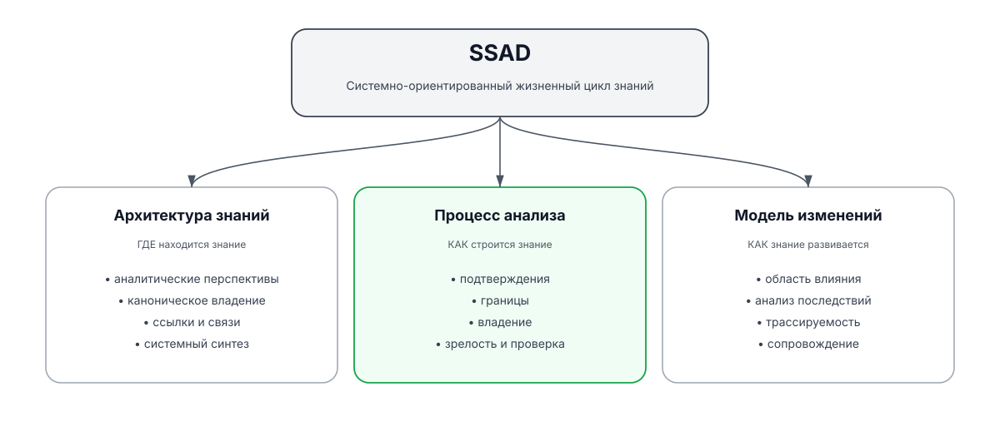
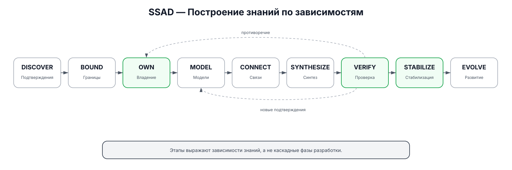

<div align="center">

# SSAD

### System-Structured Analysis Documentation

**Системно-ориентированная методология построения, организации, проверки и развития системно-аналитических знаний.**


[Английская версия](README.md)

</div>

---

## Идея

Большинство репозиториев документации организованы вокруг **типов артефактов**:

```text
requirements/
diagrams/
api/
security/
database/
```

Но реальные системы устроены иначе.

Одно изменение может одновременно затронуть продуктовые правила, владение данными, интерфейсы, компоненты во время выполнения, интеграции, безопасность, критерии приёмки и проверку.

> **SSAD организует знания вокруг самой системы: её зон ответственности, границ, владельцев, зависимостей и влияния изменений.**

<p align="center">
  
</p>

---

## Три модели — один жизненный цикл знаний

| Модель | Вопрос | Основное содержание |
|---|---|---|
| **Архитектура знаний** | Где должно находиться знание? | перспективы, каноническое владение, ссылки, системный синтез |
| **Процесс анализа** | Как знание обнаруживается и стабилизируется? | подтверждения, границы, владение, моделирование, проверка |
| **Модель изменений** | Как знание развивается вместе с системой? | область влияния изменения, анализ последствий, трассируемость, сопровождение |

SSAD — не только структура репозитория и не только процесс анализа. Это способ управлять **системными знаниями на протяжении их жизненного цикла**.

---

## Примеры и реальные применения

SSAD явно разделяет **examples** и **applications**.

### Examples — синтетические примеры

`examples/` содержит придуманные системы, созданные специально для объяснения или проверки отдельных элементов методологии.

Пример:

- не обязан существовать как настоящий продукт;
- может использовать любую архитектуру, которая помогает показать нужный принцип;
- может намеренно упрощать детали реализации;
- не является подтверждением того, что описанная система действительно была разработана;
- может специально моделировать сложную ситуацию с владением, границами, данными, интеграциями или изменениями.

Текущие примеры:

| Пример | Форма системы | Основная идея SSAD |
|---|---|---|
| [Мобильное приложение](examples/mobile-application/) | клиент + сервер + локальные/серверные данные | владение данными и граница синхронизации |
| [Настольный плагин](examples/desktop-plugin/) | плагин + приложение-хост + файловая система | граница хоста без искусственных backend/frontend |
| [Событийная платформа](examples/event-driven-platform/) | сервисы + сообщения + данные + эксплуатация | распределённое владение и асинхронные контракты |

### Applications — реальные применения

`applications/` содержит **реальные проекты, действительно документируемые по SSAD**.

Такие применения являются практическим подтверждением методологии и могут выявлять её пробелы, противоречия и необходимость новых правил.

Текущее реальное применение:

**Aveli** — локальное мобильное рабочее пространство  
[`applications/aveli/`](applications/aveli/) · [полный репозиторий проекта](https://github.com/branch-danya-dev/aveli-system-analysis)

> **Examples показывают SSAD. Applications проверяют SSAD в реальной работе.**

---

## Основные принципы

| | |
|---|---|
| **Документация отражает систему.** | Структура следует реальным зонам ответственности и границам. |
| **Сначала ответственность, затем детали.** | Контракты, схемы, состояния и размещение технологий зависят от владения. |
| **Обязательны перспективы, а не шаблон директорий.** | Разным системам могут требоваться разные физические структуры. |
| **У канонического знания один владелец.** | Контекст можно повторять, конкурирующие определения — нет. |
| **Хранение иерархично, знания образуют граф.** | Директории задают владение, ссылки отражают отношения. |
| **Подтверждения важнее архитектурных предпочтений.** | Описание существующей системы строится на фактах, а не на более красивой предполагаемой архитектуре. |
| **Системная документация является слоем синтеза.** | Межкомпонентное знание собирается в целостное представление, а не дублируется. |
| **Изменение начинается с определения области влияния.** | Влияние определяется до переработки зависимых деталей. |

Полный набор: [`specification/core-principles.ru.md`](specification/core-principles.ru.md)

---

## Как выполняется анализ

<p align="center">
  
</p>

```text
DISCOVER → BOUND → OWN → MODEL → CONNECT → SYNTHESIZE → VERIFY → STABILIZE → EVOLVE
```

Эта последовательность описывает **зависимости знаний, а не каскадные этапы разработки**.

Позднее открытие может вернуть анализ к более раннему решению. Цель не в том, чтобы избежать итераций, а в том, чтобы не считать зависимое знание стабильным, пока его исходные предпосылки остаются неопределёнными.

Подробный процесс: [`workflow/construction.ru.md`](workflow/construction.ru.md)

---

## Анализ изменений

При изменении существующей системы SSAD сначала определяет **область влияния изменения**.

```text
Запрос на изменение
      ↓
Область влияния
      ↓
Затронутые владельцы знаний
      ↓
Влияние на границы / данные / интерфейсы
      ↓
Влияние на компоненты / технологии / доверие
      ↓
Приёмка + трассируемость
      ↓
Проверка
      ↓
Stable
```

> **Каких владельцев системного знания затрагивает это изменение?**

Подробный процесс: [`workflow/change-analysis.ru.md`](workflow/change-analysis.ru.md)

---

## Развитие методологии

SSAD развивается через реальное применение и явные решения.

```text
обнаруженная проблема
      ↓
исследование на синтетическом примере и/или подтверждение реальным применением
      ↓
предложение
      ↓
проверка
      ↓
принять / отклонить / доработать
      ↓
обновить спецификацию
```

Синтетические примеры позволяют дёшево исследовать последствия решений. Реальные применения дают более сильное подтверждение, потому что методология сталкивается с настоящими ограничениями проекта.

Первое принятое решение методологии:

**ADR-001 — Аналитические перспективы вместо шаблона директорий**

[`decisions/ADR-001-perspectives-over-folder-templates.ru.md`](decisions/ADR-001-perspectives-over-folder-templates.ru.md)

---

## С чего начать

| Если нужно... | Документ |
|---|---|
| быстро понять SSAD | [`specification/methodology.ru.md`](specification/methodology.ru.md) |
| изучить принципы | [`specification/core-principles.ru.md`](specification/core-principles.ru.md) |
| посмотреть синтетические примеры | [`examples/`](examples/) |
| посмотреть реальные применения | [`applications/`](applications/) |
| применить процесс построения | [`workflow/construction.ru.md`](workflow/construction.ru.md) |
| проанализировать изменение системы | [`workflow/change-analysis.ru.md`](workflow/change-analysis.ru.md) |
| провести проверку качества | [`workflow/verification.ru.md`](workflow/verification.ru.md) |
| понять подтверждения и зрелость | [`specification/evidence-and-maturity.ru.md`](specification/evidence-and-maturity.ru.md) |
| проследить развитие методологии | [`decisions/`](decisions/) и [`proposals/`](proposals/) |

---

## Что SSAD не заменяет

SSAD не заменяет UML, BPMN, C4, ADR, OpenAPI, схемы баз данных, исходный код, тесты, управление продуктом, эксплуатационные инструкции или архитектурное управление.

SSAD определяет, **как эти формы знаний могут принадлежать системе, связываться между собой, появляться, проверяться и изменяться вместе с ней**.

---

## Текущая зрелость

```text
SSAD v0.1.2
Фундамент
+ публичное представление
+ разделение examples / applications

Синтетические примеры:
мобильное приложение
настольный плагин
событийная платформа

Реальные применения:
Aveli

Далее:
дополнительные реальные применения
→ практические сценарии
→ повторно используемые шаблоны
→ машиночитаемые метаданные
→ автоматические проверки согласованности
```

> SSAD — развивающаяся методология. Её отдельные практики не позиционируются как универсально новые; ценность заключается в их системно-ориентированном объединении, явной модели владения, рабочем процессе, модели изменений и проверке на реальных проектах.
